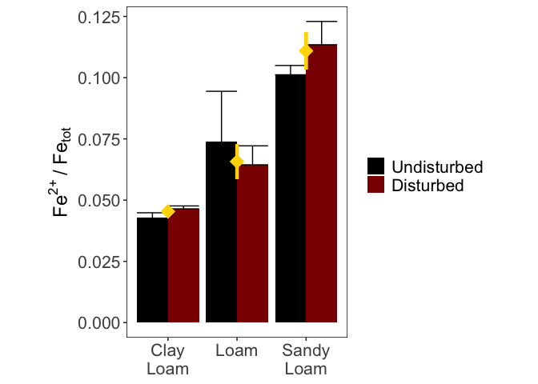
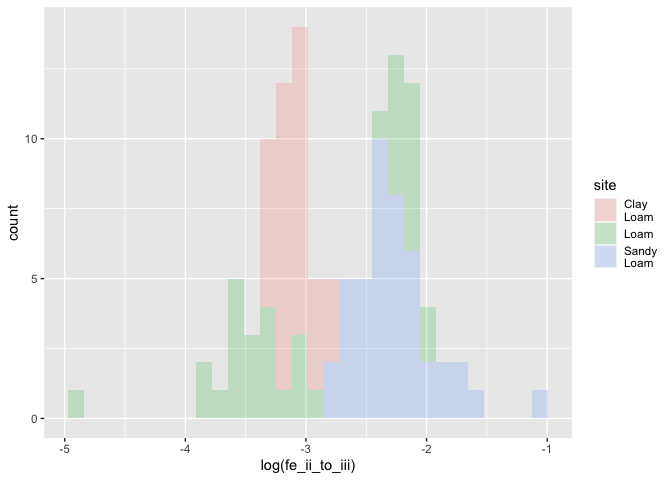
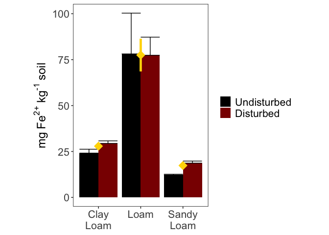
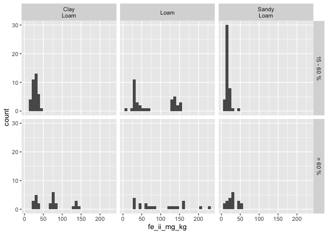
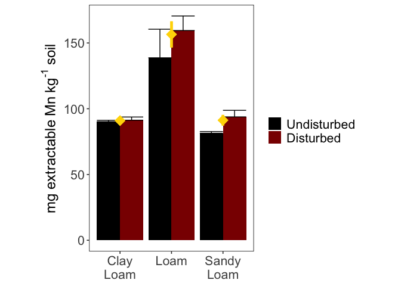
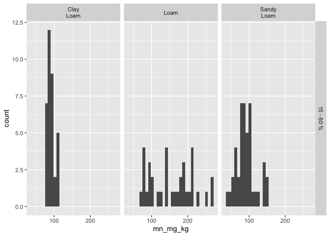

FeMn
================
Emily Lacroix
Last update: 1/14/2022

-   [Setup](#setup)
    -   [Load libraries](#load-libraries)
    -   [Files](#files)
    -   [Constants](#constants)
    -   [Figure theme](#figure-theme)
    -   [Figure labels](#figure-labels)
    -   [Useful Functions](#useful-functions)
-   [Import and Combine Data](#import-and-combine-data)
    -   [Import data](#import-data)
    -   [Combine](#combine)
-   [Figures and Analysis](#figures-and-analysis)
    -   [Fe II to III](#fe-ii-to-iii)
        -   [Figure 4](#figure-4)
        -   [Table S1: Fe/Mn replicates](#table-s1-femn-replicates)
        -   [Statistics - by bin](#statistics---by-bin)
        -   [Statistics - by site](#statistics---by-site)
    -   [Fe2+](#fe2)
        -   [Figure S6](#figure-s6)
        -   [Statistics - by bin](#statistics---by-bin-1)
        -   [Statistics - by site](#statistics---by-site-1)
    -   [Mn](#mn)
        -   [Figure S5](#figure-s5)
        -   [Statistics - by bin](#statistics---by-bin-2)
        -   [Statistics- by site](#statistics--by-site)

# Setup

## Load libraries

    library(tidyverse)

    ## ── Attaching packages ─────────────────────────────────────── tidyverse 1.3.1 ──

    ## ✓ ggplot2 3.3.5     ✓ purrr   0.3.4
    ## ✓ tibble  3.1.3     ✓ dplyr   1.0.7
    ## ✓ tidyr   1.1.3     ✓ stringr 1.4.0
    ## ✓ readr   2.0.0     ✓ forcats 0.5.1

    ## ── Conflicts ────────────────────────────────────────── tidyverse_conflicts() ──
    ## x dplyr::filter() masks stats::filter()
    ## x dplyr::lag()    masks stats::lag()

    library(readxl)
    library(multcompView)
    library(car)

    ## Loading required package: carData

    ## 
    ## Attaching package: 'car'

    ## The following object is masked from 'package:dplyr':
    ## 
    ##     recode

    ## The following object is masked from 'package:purrr':
    ## 
    ##     some

    options(dplyr.summarise.inform = FALSE)

## Files

    data_file <- "StanfordDish_AllData.xlsx"

## Constants

    control_cores <- c(1, 5, 9, 13)

## Figure theme

    my_theme <- function(base_size = 12, base_family = ""){ ## Control base font face and size. use `rel()` for relative font size.
      theme_bw(base_size = base_size, base_family = base_family) %+replace%
        theme(
          panel.border = element_rect(colour = "black", fill = "transparent"),
          panel.background  = element_blank(),
          panel.grid = element_blank(),
          strip.background = element_blank(),
          legend.position="top",
          legend.title = element_blank(),
          strip.text = element_text(size = 13)
        )
    }

## Figure labels

    site_labels <- c(
      "DISHC" = "Clay\nLoam",
      "DISHT" = "Loam",
      "DISHR" = "Sandy\nLoam"
    )

## Useful Functions

    tri.to.squ<-function(x)
    {
      rn <- row.names(x)
      cn <- colnames(x)
      an <- unique(c(cn,rn))
      myval <- x[!is.na(x)]
      mymat <- 
        matrix(1, nrow = length(an), ncol = length(an), dimnames = list(an,an))
      for(ext in 1:length(cn))
      {
        for(int in 1:length(rn))
        {
          if(is.na(x[row.names(x) == rn[int], colnames(x) == cn[ext]])) next
          mymat[row.names(mymat) == rn[int], colnames(mymat) == cn[ext]] <- 
            x[row.names(x) == rn[int], colnames(x) == cn[ext]]
          mymat[row.names(mymat) == cn[ext], colnames(mymat) == rn[int]] <- 
            x[row.names(x) == rn[int], colnames(x) == cn[ext]]
        }
      }
      return(mymat)
    }

# Import and Combine Data

## Import data

    fe_mn <- 
      data_file %>% 
      read_xlsx(sheet = "FeMnHCl")

    dist_grav <- 
      data_file %>% 
      read_xlsx(sheet = "GravimetricData - Oxic")

## Combine

This code: \* joins the Fe and Mn data with the associated moisture data
for the core \* Categorizes cores as disturbed or undisturbed \* Assigns
the cores to a WFPS bin \* Eliminates cores with &lt; 15% WFPS \* Makes
sites and WFPS category into factors

    fe_mn_data <-
      fe_mn %>% 
      full_join(dist_grav, by = c("site", "core", "experiment")) %>% 
      mutate(
        wfps_bin = 
          factor(
            case_when(
              wfps <= 60 ~ "15 - 60 %",
              is.na(wfps) ~ "15 - 60 %",
              experiment == "OxEn" ~ "15 - 60 %",
              wfps > 60 ~ "> 60 %",
              TRUE ~ NA_character_
            ),
            levels = c("15 - 60 %", "> 60 %")
          )
      ) %>% 
      filter(wfps >= 15 | experiment == "OxEn") %>% 
      mutate(
        control_disturbed = 
          factor(
            if_else(
              (core %in% control_cores | experiment == "OxEn"), 
              "Undisturbed", 
              "Disturbed"
            ),
            levels = c("Undisturbed", "Disturbed")
          ),
        across("site", factor, levels = c("DISHC", "DISHT", "DISHR"), labels = site_labels),
        across(wfps_bin, factor, levels = c("15 - 60 %", "> 60 %"))
      ) 

    fe_mn

    ## # A tibble: 249 × 8
    ##    site   core   rep fe_tot_mg_kg mn_mg_kg fe_ii_mg_kg fe_ii_to_iii experiment
    ##    <chr> <dbl> <dbl>        <dbl>    <dbl>       <dbl>        <dbl> <chr>     
    ##  1 DISHT     1     1        1828.     89.7        193.       0.105  DI        
    ##  2 DISHT     2     1        1449.    199.         153.       0.106  DI        
    ##  3 DISHT     3     1        1517.     84.5        169.       0.111  DI        
    ##  4 DISHT     4     1        1313.    131.         162.       0.123  DI        
    ##  5 DISHT     5     1        1152.     95.2        132.       0.115  DI        
    ##  6 DISHT     6     1        1173.    142.         140.       0.119  DI        
    ##  7 DISHT     7     1        1495.     93.6        149.       0.0995 DI        
    ##  8 DISHT     8     1        1307.    120.         138.       0.106  DI        
    ##  9 DISHT     9     1        1538.    114.         162.       0.105  DI        
    ## 10 DISHT    10     1        1287.    104.         136.       0.106  DI        
    ## # … with 239 more rows

# Figures and Analysis

## Fe II to III

    fe_ii_to_iii_averages <- 
      fe_mn_data %>% 
      filter(wfps_bin == "15 - 60 %") %>% 
      group_by(site) %>% 
      summarise(
        site_avg_fe_ii_to_iii = mean(fe_ii_to_iii, na.rm = TRUE),
        site_se_fe_ii_to_iii = sd(fe_ii_to_iii, na.rm = TRUE) / sqrt(n())
      )

    fe_ii_to_iii_averages

    ## # A tibble: 3 × 3
    ##   site          site_avg_fe_ii_to_iii site_se_fe_ii_to_iii
    ##   <fct>                         <dbl>                <dbl>
    ## 1 "Clay\nLoam"                 0.0454              0.00108
    ## 2 "Loam"                       0.0657              0.00717
    ## 3 "Sandy\nLoam"                0.111               0.00762

### Figure 4

    fe_mn_data %>% 
      group_by(site, wfps_bin, control_disturbed) %>% 
      summarise(
        avg_fe_ii_to_iii = mean(fe_ii_to_iii, na.rm = TRUE),
        se_fe_ii_to_iii = sd(fe_ii_to_iii, na.rm = TRUE) / sqrt(n())
      ) %>% 
      left_join(fe_ii_to_iii_averages, by = "site") %>% 
      filter(wfps_bin == "15 - 60 %") %>% 
      ggplot(aes(x = site, group = control_disturbed)) +
      geom_col(aes(y = avg_fe_ii_to_iii, fill = control_disturbed), position = "dodge") +
      geom_errorbar(
        aes(ymin = avg_fe_ii_to_iii, ymax = avg_fe_ii_to_iii + se_fe_ii_to_iii),
        position = "dodge",
      ) +
      geom_errorbar(
        aes(
          ymin = site_avg_fe_ii_to_iii - site_se_fe_ii_to_iii,
          ymax = site_avg_fe_ii_to_iii + site_se_fe_ii_to_iii
        ),
        color = "gold",
        width = 0,
        size = 1.5
      ) + 
      geom_point(
        aes(
          y = site_avg_fe_ii_to_iii, 

        ), 
        color = "gold", 
        shape = 18, 
        size = 6
      ) + 
      scale_fill_manual(values = c("black", "darkred")) + 
      my_theme() +
      theme(
        aspect.ratio = 1.5,
        legend.position = "right",
        axis.text = element_text(size = 16),
        axis.title = element_text(size = 18),
        legend.text = element_text(size = 16)
      ) +
      labs(
        x = NULL,
        y = expression(paste(Fe^`2+`~`/`~Fe[tot]))
      )

<!-- -->

### Table S1: Fe/Mn replicates

    fe_mn_data %>% 
      group_by(site, wfps_bin, control_disturbed) %>% 
      summarise(
        avg_fe_ii_to_iii = mean(fe_ii_to_iii, na.rm = TRUE),
        se_fe_ii_to_iii = sd(fe_ii_to_iii, na.rm = TRUE) / sqrt(n()),
        reps = n()
      ) %>% 
      filter(wfps_bin == "15 - 60 %")

    ## # A tibble: 6 × 6
    ## # Groups:   site, wfps_bin [3]
    ##   site          wfps_bin control_disturb… avg_fe_ii_to_iii se_fe_ii_to_iii  reps
    ##   <fct>         <fct>    <fct>                       <dbl>           <dbl> <int>
    ## 1 "Clay\nLoam"  15 - 60… Undisturbed                0.0427         0.00218    10
    ## 2 "Clay\nLoam"  15 - 60… Disturbed                  0.0464         0.00119    25
    ## 3 "Loam"        15 - 60… Undisturbed                0.0737         0.0207      5
    ## 4 "Loam"        15 - 60… Disturbed                  0.0644         0.00775    30
    ## 5 "Sandy\nLoam" 15 - 60… Undisturbed                0.101          0.00379     9
    ## 6 "Sandy\nLoam" 15 - 60… Disturbed                  0.113          0.00951    35

### Statistics - by bin

#### Check normality

    fe_mn_data %>% 
      filter(wfps_bin == "15 - 60 %") %>% 
      group_by(site, wfps_bin, control_disturbed) %>%
      summarise(
        normality_stat = shapiro.test(fe_ii_to_iii)$statistic,
        normality_p_value = shapiro.test(fe_ii_to_iii)$p.value
      ) #common transformations do not help normality

    ## # A tibble: 6 × 5
    ## # Groups:   site, wfps_bin [3]
    ##   site          wfps_bin  control_disturbed normality_stat normality_p_value
    ##   <fct>         <fct>     <fct>                      <dbl>             <dbl>
    ## 1 "Clay\nLoam"  15 - 60 % Undisturbed                0.885       0.150      
    ## 2 "Clay\nLoam"  15 - 60 % Disturbed                  0.936       0.117      
    ## 3 "Loam"        15 - 60 % Undisturbed                0.786       0.0616     
    ## 4 "Loam"        15 - 60 % Disturbed                  0.824       0.000188   
    ## 5 "Sandy\nLoam" 15 - 60 % Undisturbed                0.944       0.629      
    ## 6 "Sandy\nLoam" 15 - 60 % Disturbed                  0.715       0.000000653

#### Check for equal variances

    leveneTest(
      fe_ii_to_iii ~ site*wfps_bin*control_disturbed, 
      data = fe_mn_data %>% filter(wfps_bin == "15 - 60 %")
    )

    ## Levene's Test for Homogeneity of Variance (center = median)
    ##        Df F value    Pr(>F)    
    ## group   5  4.5648 0.0008145 ***
    ##       108                      
    ## ---
    ## Signif. codes:  0 '***' 0.001 '**' 0.01 '*' 0.05 '.' 0.1 ' ' 1

Non-normally distributed data with unequal variances. Pairwise wilcoxon
rank sum test would be appropriate

#### Pairwise wilcoxon rank sum

    wilcoxon_fe_mn_data <-
      fe_mn_data %>% 
      mutate(
        wfps_id = 
          case_when(
            wfps_bin == "15 - 60 %" ~ "dry",
            wfps_bin == "> 60 %" ~ "wet",        
          ),
        wilcoxon_id = str_c(site,"_",control_disturbed,"_",wfps_id)
      )

    fe_ii_to_iii_wilcox <- 
      pairwise.wilcox.test(
      x = wilcoxon_fe_mn_data$fe_ii_to_iii,
      g = wilcoxon_fe_mn_data$wilcoxon_id,
      p.adjust.method = "BH",
      paired = FALSE
    )

    fe_ii_to_iii_matrix <- tri.to.squ(fe_ii_to_iii_wilcox$p.value)
    fe_ii_to_iii_letters <- 
      multcompLetters(
        fe_ii_to_iii_matrix, 
        compare ="<=", 
        threshold = 0.05, 
        Letters = letters
      )

    fe_ii_to_iii_letters

    ##    Clay\nLoam_Disturbed_dry    Clay\nLoam_Disturbed_wet 
    ##                         "a"                         "b" 
    ##  Clay\nLoam_Undisturbed_dry  Clay\nLoam_Undisturbed_wet 
    ##                         "a"                        "bc" 
    ##          Loam_Disturbed_dry          Loam_Disturbed_wet 
    ##                        "ac"                       "abc" 
    ##        Loam_Undisturbed_dry        Loam_Undisturbed_wet 
    ##                       "abc"                        "bc" 
    ##   Sandy\nLoam_Disturbed_dry   Sandy\nLoam_Disturbed_wet 
    ##                         "b"                        "bc" 
    ## Sandy\nLoam_Undisturbed_dry Sandy\nLoam_Undisturbed_wet 
    ##                        "bc"                         "b"

### Statistics - by site

    fe_mn_data %>% 
      filter(wfps_bin == "15 - 60 %") %>% 
      group_by(site) %>%
      summarise(
        normality_stat = shapiro.test(fe_ii_to_iii)$statistic,
        normality_p_value = shapiro.test(fe_ii_to_iii)$p.value
      ) #common transformations do not help normality

    ## # A tibble: 3 × 3
    ##   site          normality_stat normality_p_value
    ##   <fct>                  <dbl>             <dbl>
    ## 1 "Clay\nLoam"           0.950      0.112       
    ## 2 "Loam"                 0.827      0.0000716   
    ## 3 "Sandy\nLoam"          0.689      0.0000000230

    fe_mn_data %>% 
      filter(wfps_bin == "15 - 60 %") %>% 
      ggplot() +
      geom_histogram(aes(x = log(fe_ii_to_iii), fill = site), alpha = 0.2)

    ## `stat_bin()` using `bins = 30`. Pick better value with `binwidth`.

<!-- -->

    leveneTest(
      fe_ii_to_iii ~ site, 
      data = fe_mn_data %>% filter(wfps_bin == "15 - 60 %")
    )

    ## Levene's Test for Homogeneity of Variance (center = median)
    ##        Df F value    Pr(>F)    
    ## group   2  9.5531 0.0001486 ***
    ##       111                      
    ## ---
    ## Signif. codes:  0 '***' 0.001 '**' 0.01 '*' 0.05 '.' 0.1 ' ' 1

Non-normally distributed data with unequal variances. Pairwise wilcoxon
rank sum test would be appropriate

#### Pairwise Wilcoxon by site

    wilcoxon_fe_mn_data_site <-
      fe_mn_data %>% 
      filter(wfps_bin == "15 - 60 %")

    fe_ii_to_iii_wilcox_site <- 
      pairwise.wilcox.test(
      x = wilcoxon_fe_mn_data_site$fe_ii_to_iii,
      g = wilcoxon_fe_mn_data_site$site,
      p.adjust.method = "BH",
      paired = FALSE
    )

    fe_ii_to_iii_matrix_site <- tri.to.squ(fe_ii_to_iii_wilcox_site$p.value)
    fe_ii_to_iii_letters_site <- 
      multcompLetters(
        fe_ii_to_iii_matrix_site, 
        compare ="<=", 
        threshold = 0.05, 
        Letters = letters
      )

    fe_ii_to_iii_letters_site

    ##  Clay\nLoam        Loam Sandy\nLoam 
    ##         "a"         "a"         "b"

    fe_ii_to_iii_wilcox_site

    ## 
    ##  Pairwise comparisons using Wilcoxon rank sum exact test 
    ## 
    ## data:  wilcoxon_fe_mn_data_site$fe_ii_to_iii and wilcoxon_fe_mn_data_site$site 
    ## 
    ##             Clay\nLoam Loam  
    ## Loam        0.8702     -     
    ## Sandy\nLoam <2e-16     0.0008
    ## 
    ## P value adjustment method: BH

## Fe2+

### Figure S6

    fe_ii_averages <- 
      fe_mn_data %>% 
      filter(wfps_bin == "15 - 60 %") %>% 
      group_by(site) %>% 
      summarise(
        site_avg_fe_ii = mean(fe_ii_mg_kg, na.rm = TRUE),
        site_se_fe_ii = sd(fe_ii_mg_kg, na.rm = TRUE) / sqrt(n())
      )

    fe_ii_averages

    ## # A tibble: 3 × 3
    ##   site          site_avg_fe_ii site_se_fe_ii
    ##   <fct>                  <dbl>         <dbl>
    ## 1 "Clay\nLoam"            27.9         1.22 
    ## 2 "Loam"                  77.5         8.90 
    ## 3 "Sandy\nLoam"           17.4         0.970

    fe_mn_data %>% 
      filter(wfps_bin == "15 - 60 %") %>% 
      group_by(site, wfps_bin, control_disturbed) %>% 
      summarise(
        avg_fe_ii = mean(fe_ii_mg_kg, na.rm = TRUE),
        se_fe_ii = sd(fe_ii_mg_kg, na.rm = TRUE) / sqrt(n())
      ) %>% 
      left_join(fe_ii_averages, by = "site") %>% 
      ggplot(aes(x = site, fill = control_disturbed)) +
      geom_col(aes(y = avg_fe_ii), position = "dodge") + 
      geom_errorbar(
        aes(ymin = avg_fe_ii, ymax = avg_fe_ii + se_fe_ii),
        position = "dodge"
      ) + 
      geom_errorbar(
        aes(
          ymin = site_avg_fe_ii - site_se_fe_ii,
          ymax = site_avg_fe_ii + site_se_fe_ii
        ),
        color = "gold",
        width = 0,
        size = 1.5
      ) + 
      geom_point(
        aes(
          y = site_avg_fe_ii, 

        ), 
        color = "gold", 
        shape = 18, 
        size = 6,
        show.legend = FALSE
      ) + 
      scale_fill_manual(values = c("black", "darkred")) + 
      my_theme() + 
      theme(
        aspect.ratio = 1.5,
        legend.position = "right",
        axis.text = element_text(size = 16),
        axis.title = element_text(size = 18),
        legend.text = element_text(size = 16)
      ) +
      labs(
        x = NULL,
        y = expression(paste(mg~Fe^`2+`~kg^`-1`~soil))
      )

<!-- -->

### Statistics - by bin

#### Check for normality

    fe_mn_data %>% 
      filter(wfps_bin == "15 - 60 %") %>% 
      group_by(site, wfps_bin, control_disturbed) %>%
      summarise(
        normality_stat = shapiro.test(log(fe_ii_mg_kg))$statistic,
        normality_p_value = shapiro.test(log(fe_ii_mg_kg))$p.value
      ) #common transformations do not help normality

    ## # A tibble: 6 × 5
    ## # Groups:   site, wfps_bin [3]
    ##   site          wfps_bin  control_disturbed normality_stat normality_p_value
    ##   <fct>         <fct>     <fct>                      <dbl>             <dbl>
    ## 1 "Clay\nLoam"  15 - 60 % Undisturbed                0.829          0.0321  
    ## 2 "Clay\nLoam"  15 - 60 % Disturbed                  0.931          0.0898  
    ## 3 "Loam"        15 - 60 % Undisturbed                0.759          0.0361  
    ## 4 "Loam"        15 - 60 % Disturbed                  0.851          0.000636
    ## 5 "Sandy\nLoam" 15 - 60 % Undisturbed                0.795          0.0178  
    ## 6 "Sandy\nLoam" 15 - 60 % Disturbed                  0.927          0.0223

    fe_mn_data %>% 
      ggplot(aes(x = fe_ii_mg_kg)) + 
      geom_histogram() + 
      facet_grid(cols = vars(site), rows = vars(wfps_bin))

    ## `stat_bin()` using `bins = 30`. Pick better value with `binwidth`.

<!-- --> Non-normal
data. Transformations (not shown) do not seem to help.

#### Check for equal variances

    leveneTest(
      fe_ii_mg_kg ~ site*wfps_bin*control_disturbed, 
      data = fe_mn_data 
    )

    ## Levene's Test for Homogeneity of Variance (center = median)
    ##        Df F value    Pr(>F)    
    ## group  11  12.119 < 2.2e-16 ***
    ##       167                      
    ## ---
    ## Signif. codes:  0 '***' 0.001 '**' 0.01 '*' 0.05 '.' 0.1 ' ' 1

Unequal variances.

#### Pairwise wilcoxon rank sum

    fe_ii_wilcox <- 
      pairwise.wilcox.test(
      x = wilcoxon_fe_mn_data$fe_ii_mg_kg,
      g = wilcoxon_fe_mn_data$wilcoxon_id,
      p.adjust.method = "BH",
      paired = FALSE
    )

    fe_ii_matrix <- tri.to.squ(fe_ii_wilcox$p.value)
    fe_ii_letters <- multcompLetters(fe_ii_matrix, compare ="<=", threshold = 0.05, Letters = letters)

    fe_ii_letters

    ##    Clay\nLoam_Disturbed_dry    Clay\nLoam_Disturbed_wet 
    ##                         "a"                         "b" 
    ##  Clay\nLoam_Undisturbed_dry  Clay\nLoam_Undisturbed_wet 
    ##                         "a"                        "bc" 
    ##          Loam_Disturbed_dry          Loam_Disturbed_wet 
    ##                         "b"                        "bc" 
    ##        Loam_Undisturbed_dry        Loam_Undisturbed_wet 
    ##                        "bc"                         "c" 
    ##   Sandy\nLoam_Disturbed_dry   Sandy\nLoam_Disturbed_wet 
    ##                         "d"                       "ade" 
    ## Sandy\nLoam_Undisturbed_dry Sandy\nLoam_Undisturbed_wet 
    ##                         "e"                         "a"

### Statistics - by site

#### Check for normality

    fe_mn_data %>% 
      filter(wfps_bin == "15 - 60 %") %>% 
      group_by(site) %>%
      summarise(
        normality_stat = shapiro.test(fe_ii_mg_kg)$statistic,
        normality_p_value = shapiro.test(fe_ii_mg_kg)$p.value
      ) #common transformations do not help normality

    ## # A tibble: 3 × 3
    ##   site          normality_stat normality_p_value
    ##   <fct>                  <dbl>             <dbl>
    ## 1 "Clay\nLoam"           0.940        0.0571    
    ## 2 "Loam"                 0.789        0.0000125 
    ## 3 "Sandy\nLoam"          0.793        0.00000207

    fe_mn_data %>% 
      ggplot(aes(x = fe_ii_mg_kg)) + 
      geom_histogram() + 
      facet_grid(cols = vars(site), rows = vars(wfps_bin))

    ## `stat_bin()` using `bins = 30`. Pick better value with `binwidth`.

<!-- -->

#### Check for equal variances

    leveneTest(
      fe_ii_mg_kg ~ site*wfps_bin*control_disturbed, 
      data = fe_mn_data 
    )

    ## Levene's Test for Homogeneity of Variance (center = median)
    ##        Df F value    Pr(>F)    
    ## group  11  12.119 < 2.2e-16 ***
    ##       167                      
    ## ---
    ## Signif. codes:  0 '***' 0.001 '**' 0.01 '*' 0.05 '.' 0.1 ' ' 1

#### Pairwise Wilcoxon rank sum

    fe_ii_wilcox <- 
      pairwise.wilcox.test(
      x = wilcoxon_fe_mn_data$fe_ii_mg_kg,
      g = wilcoxon_fe_mn_data$site,
      p.adjust.method = "BH",
      paired = FALSE
    )

    fe_ii_matrix_site <- tri.to.squ(fe_ii_wilcox$p.value)
    fe_ii_letters_site <- multcompLetters(fe_ii_matrix_site, compare ="<=", threshold = 0.05, Letters = letters)

    fe_ii_letters_site

    ##  Clay\nLoam        Loam Sandy\nLoam 
    ##         "a"         "b"         "c"

## Mn

### Figure S5

    mn_averages <- 
      fe_mn_data %>% 
      filter(wfps_bin == "15 - 60 %") %>% 
      group_by(site) %>% 
      summarise(
        site_avg_mn = mean(mn_mg_kg, na.rm = TRUE),
        site_se_mn = sd(mn_mg_kg, na.rm = TRUE) / sqrt(n())
      )

    fe_mn_data %>% 
      filter(wfps_bin == "15 - 60 %") %>% 
      group_by(site, wfps_bin, control_disturbed) %>% 
      summarise(
        avg_mn = mean(mn_mg_kg, na.rm = TRUE),
        se_mn = sd(mn_mg_kg, na.rm = TRUE) / sqrt(n())
      ) %>% 
      left_join(mn_averages, by = "site") %>% 
      ggplot(aes(x = site, fill = control_disturbed)) +
      geom_col(aes(y = avg_mn), position = "dodge") + 
      geom_errorbar(
        aes(ymin = avg_mn, ymax = avg_mn + se_mn),
        position = "dodge"
      ) + 
      geom_errorbar(
        aes(
          ymin = site_avg_mn - site_se_mn,
          ymax = site_avg_mn + site_se_mn
        ),
        color = "gold",
        width = 0,
        size = 1.5
      ) + 
      geom_point(
        aes(
          y = site_avg_mn, 

        ), 
        color = "gold", 
        shape = 18, 
        size = 6,
        show.legend = FALSE
      ) + 
      scale_fill_manual(values = c("black", "darkred")) + 
      my_theme() + 
      theme(
        aspect.ratio = 1.5,
        legend.position = "right",
        axis.text = element_text(size = 16),
        axis.title = element_text(size = 18),
        legend.text = element_text(size = 16)
      ) +
      labs(
        x = NULL,
        y = expression(paste(mg~extractable~Mn~kg^`-1`~soil))
      )

<!-- -->

### Statistics - by bin

#### Check for normality

    fe_mn_data %>% 
      filter(wfps_bin == "15 - 60 %") %>% 
      group_by(site, wfps_bin, control_disturbed) %>%
      summarise(
        normality_stat = shapiro.test(mn_mg_kg)$statistic,
        normality_p_value = shapiro.test(mn_mg_kg)$p.value
      )

    ## # A tibble: 6 × 5
    ## # Groups:   site, wfps_bin [3]
    ##   site          wfps_bin  control_disturbed normality_stat normality_p_value
    ##   <fct>         <fct>     <fct>                      <dbl>             <dbl>
    ## 1 "Clay\nLoam"  15 - 60 % Undisturbed                0.934            0.484 
    ## 2 "Clay\nLoam"  15 - 60 % Disturbed                  0.932            0.0958
    ## 3 "Loam"        15 - 60 % Undisturbed                0.899            0.403 
    ## 4 "Loam"        15 - 60 % Disturbed                  0.939            0.0867
    ## 5 "Sandy\nLoam" 15 - 60 % Undisturbed                0.856            0.0877
    ## 6 "Sandy\nLoam" 15 - 60 % Disturbed                  0.960            0.226

    fe_mn_data %>% 
      filter(wfps_bin == "15 - 60 %") %>% 
      ggplot(aes(x = mn_mg_kg)) + 
      geom_histogram() + 
      facet_grid(cols = vars(site), rows = vars(wfps_bin))

    ## `stat_bin()` using `bins = 30`. Pick better value with `binwidth`.

<!-- -->

#### Check for equal variances

    leveneTest(
      mn_mg_kg ~ site*wfps_bin*control_disturbed, 
      data = fe_mn_data 
    )

    ## Levene's Test for Homogeneity of Variance (center = median)
    ##        Df F value    Pr(>F)    
    ## group  11  13.199 < 2.2e-16 ***
    ##       167                      
    ## ---
    ## Signif. codes:  0 '***' 0.001 '**' 0.01 '*' 0.05 '.' 0.1 ' ' 1

They are normally distributed with unequal variances. Will need to use
Welch’s ANOVA!

#### Welch’s ANOVA

    oneway.test(
      mn_mg_kg ~ site*control_disturbed, 
      data = fe_mn_data %>% filter(wfps_bin == "15 - 60 %"), 
      var.equal = FALSE
    )

    ## 
    ##  One-way analysis of means (not assuming equal variances)
    ## 
    ## data:  mn_mg_kg and site * control_disturbed
    ## F = 14.785, num df = 5.000, denom df = 27.538, p-value = 4.496e-07

    mn_aov <- 
      aov(  
        mn_mg_kg ~ site*control_disturbed, 
        data = fe_mn_data %>% filter(wfps_bin == "15 - 60 %"), 
        var.equal = FALSE
      )

    ## Warning: In lm.fit(x, y, offset = offset, singular.ok = singular.ok, ...) :
    ##  extra argument 'var.equal' will be disregarded

Now I can do a Tukey’s HSD as a follow-up

    TukeyHSD(mn_aov)

    ##   Tukey multiple comparisons of means
    ##     95% family-wise confidence level
    ## 
    ## Fit: aov(formula = mn_mg_kg ~ site * control_disturbed, data = fe_mn_data %>% filter(wfps_bin == "15 - 60 %"), var.equal = FALSE)
    ## 
    ## $site
    ##                               diff       lwr       upr     p adj
    ## Loam-Clay\nLoam         65.5434840  44.43337  86.65359 0.0000000
    ## Sandy\nLoam-Clay\nLoam   0.2915098 -19.71000  20.29302 0.9993388
    ## Sandy\nLoam-Loam       -65.2519742 -85.25348 -45.25047 0.0000000
    ## 
    ## $control_disturbed
    ##                           diff       lwr      upr     p adj
    ## Disturbed-Undisturbed 9.838275 -7.083526 26.76007 0.2516895
    ## 
    ## $`site:control_disturbed`
    ##                                                      diff        lwr        upr
    ## Loam:Undisturbed-Clay\nLoam:Undisturbed         48.603690  -10.45276 107.660144
    ## Sandy\nLoam:Undisturbed-Clay\nLoam:Undisturbed  -8.784889  -58.32561  40.755828
    ## Clay\nLoam:Disturbed-Clay\nLoam:Undisturbed      1.168000  -39.17524  41.511238
    ## Loam:Disturbed-Clay\nLoam:Undisturbed           69.340116   29.96915 108.711086
    ## Sandy\nLoam:Disturbed-Clay\nLoam:Undisturbed     3.674257  -34.98727  42.335782
    ## Sandy\nLoam:Undisturbed-Loam:Undisturbed       -57.388579 -117.52873   2.751570
    ## Clay\nLoam:Disturbed-Loam:Undisturbed          -47.435690 -100.25739   5.386008
    ## Loam:Disturbed-Loam:Undisturbed                 20.736426  -31.34647  72.819323
    ## Sandy\nLoam:Disturbed-Loam:Undisturbed         -44.929433  -96.47813   6.619266
    ## Clay\nLoam:Disturbed-Sandy\nLoam:Undisturbed     9.952889  -31.96071  51.866486
    ## Loam:Disturbed-Sandy\nLoam:Undisturbed          78.125005   37.14640 119.103609
    ## Sandy\nLoam:Disturbed-Sandy\nLoam:Undisturbed   12.459146  -27.83833  52.756618
    ## Loam:Disturbed-Clay\nLoam:Disturbed             68.172116   38.97382  97.370409
    ## Sandy\nLoam:Disturbed-Clay\nLoam:Disturbed       2.506257  -25.72813  30.740643
    ## Sandy\nLoam:Disturbed-Loam:Disturbed           -65.665859  -92.49265 -38.839065
    ##                                                    p adj
    ## Loam:Undisturbed-Clay\nLoam:Undisturbed        0.1697140
    ## Sandy\nLoam:Undisturbed-Clay\nLoam:Undisturbed 0.9955124
    ## Clay\nLoam:Disturbed-Clay\nLoam:Undisturbed    0.9999994
    ## Loam:Disturbed-Clay\nLoam:Undisturbed          0.0000204
    ## Sandy\nLoam:Disturbed-Clay\nLoam:Undisturbed   0.9997789
    ## Sandy\nLoam:Undisturbed-Loam:Undisturbed       0.0704540
    ## Clay\nLoam:Disturbed-Loam:Undisturbed          0.1046981
    ## Loam:Disturbed-Loam:Undisturbed                0.8567901
    ## Sandy\nLoam:Disturbed-Loam:Undisturbed         0.1248880
    ## Clay\nLoam:Disturbed-Sandy\nLoam:Undisturbed   0.9828313
    ## Loam:Disturbed-Sandy\nLoam:Undisturbed         0.0000033
    ## Sandy\nLoam:Disturbed-Sandy\nLoam:Undisturbed  0.9464324
    ## Loam:Disturbed-Clay\nLoam:Disturbed            0.0000000
    ## Sandy\nLoam:Disturbed-Clay\nLoam:Disturbed     0.9998420
    ## Sandy\nLoam:Disturbed-Loam:Disturbed           0.0000000

The only significant differences are between the sites. Going to
simplify analysis to focus solely on site-wide differences

### Statistics- by site

#### Check normality

NOTE: a transformation was necessary to achieve normal data

    fe_mn_data %>% 
      filter(wfps_bin == "15 - 60 %") %>% 
      group_by(site) %>%
      summarise(
        normality_stat = shapiro.test((mn_mg_kg)^0.33333333)$statistic,
        normality_p_value = shapiro.test((mn_mg_kg)^0.33333333)$p.value
      )

    ## # A tibble: 3 × 3
    ##   site          normality_stat normality_p_value
    ##   <fct>                  <dbl>             <dbl>
    ## 1 "Clay\nLoam"           0.962            0.255 
    ## 2 "Loam"                 0.939            0.0510
    ## 3 "Sandy\nLoam"          0.973            0.390

     #will do stats on transformed values

#### Check for equal variances

    leveneTest(
      (mn_mg_kg)^0.33333333 ~ site, 
      data = fe_mn_data 
    )

    ## Levene's Test for Homogeneity of Variance (center = median)
    ##        Df F value  Pr(>F)  
    ## group   2  2.4739 0.08718 .
    ##       176                  
    ## ---
    ## Signif. codes:  0 '***' 0.001 '**' 0.01 '*' 0.05 '.' 0.1 ' ' 1

Will transform mn data by taking cube root and then performing ANOVA.

#### ANOVA on transformed (cube root) data

    mn_stats_data <- 
      fe_mn_data %>% 
      filter(wfps_bin == "15 - 60 %") %>% 
      mutate(
        mn_transformed = mn_mg_kg ^ (1/3)
      )

    mn_aov <- aov(mn_transformed ~ site, data = mn_stats_data)

    summary(mn_aov)

    ##              Df Sum Sq Mean Sq F value   Pr(>F)    
    ## site          2  16.62   8.312   35.94 9.23e-13 ***
    ## Residuals   111  25.67   0.231                     
    ## ---
    ## Signif. codes:  0 '***' 0.001 '**' 0.01 '*' 0.05 '.' 0.1 ' ' 1

    TukeyHSD(mn_aov)

    ##   Tukey multiple comparisons of means
    ##     95% family-wise confidence level
    ## 
    ## Fit: aov(formula = mn_transformed ~ site, data = mn_stats_data)
    ## 
    ## $site
    ##                              diff        lwr        upr     p adj
    ## Loam-Clay\nLoam         0.8104162  0.5373168  1.0835157 0.0000000
    ## Sandy\nLoam-Clay\nLoam -0.0305985 -0.2893560  0.2281590 0.9574493
    ## Sandy\nLoam-Loam       -0.8410147 -1.0997723 -0.5822572 0.0000000
