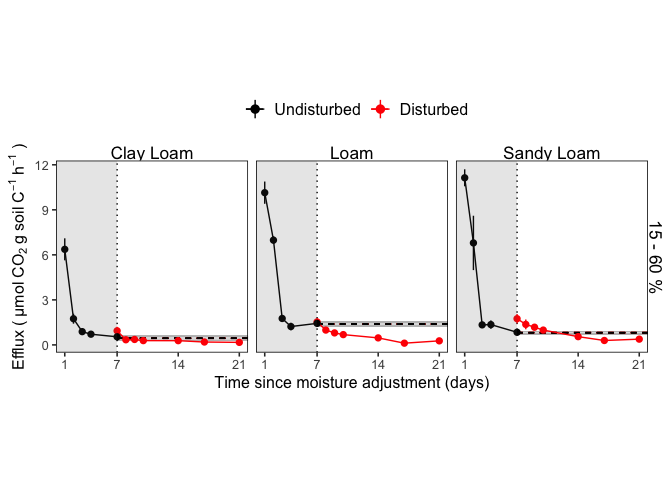

Incubation GHG Fluxes
================
Emily Lacroix
Last update 1/19/2022

-   [Setup](#setup)
    -   [Load libraries](#load-libraries)
    -   [Files](#files)
    -   [Constants](#constants)
    -   [Figure theme](#figure-theme)
    -   [Figure labels](#figure-labels)
-   [Import and Combine Data](#import-and-combine-data)
    -   [Import data](#import-data)
    -   [Combine Data](#combine-data)
        -   [Disturbance Incubation -
            Oxic](#disturbance-incubation---oxic)
        -   [Disturbance Incubation - Anoxic
            Control](#disturbance-incubation---anoxic-control)
-   [Figures and Analysis](#figures-and-analysis)
    -   [Physical disturbance incubation
        (oxic)](#physical-disturbance-incubation-oxic)
        -   [Figure 2: Efflux from physical disturbance
            incubation](#figure-2-efflux-from-physical-disturbance-incubation)
        -   [Figure S1 - Disturbance incubation control
            cores](#figure-s1---disturbance-incubation-control-cores)
    -   [Physical disturbance incubation
        (anoxic)](#physical-disturbance-incubation-anoxic)
        -   [Isolate undisturbed and pre-disturbance
            fluxes](#isolate-undisturbed-and-pre-disturbance-fluxes)
        -   [Figure 3 - Anoxic CO2
            efflux](#figure-3---anoxic-co2-efflux)
        -   [Table S1 - Calculating
            replicates](#table-s1---calculating-replicates)
        -   [Figure S2 - Anoxic disturbance
            incubation](#figure-s2---anoxic-disturbance-incubation)
        -   [Figure 3 Inset: Excess CO2 Evolved in Disturbed vs
            Calculated (Anoxic
            disturbance)](#figure-3-inset-excess-co2-evolved-in-disturbed-vs-calculated-anoxic-disturbance)
    -   [Oxygen Enrichment](#oxygen-enrichment)
        -   [Figure 1 - Oxygen enrichment
            flux](#figure-1---oxygen-enrichment-flux)
        -   [Statistics: atmospheric vs enriched efflux by
            day](#statistics-atmospheric-vs-enriched-efflux-by-day)
    -   [Figure 1 Inset: Cumulative
        fluxes](#figure-1-inset-cumulative-fluxes)
        -   [Statistics - Atmospheric vs
            Enriched](#statistics---atmospheric-vs-enriched)

# Setup

## Load libraries

    library(tidyverse)
    library(readxl)
    library(multcompView)
    library(car)

    options(dplyr.summarise.inform = FALSE)

## Files

    data_file <- "StanfordDish_AllData.xlsx"

## Constants

    control_cores <- c(1, 5, 9, 13)

    soil_core_area_m2 <- 0.00203

    anoxic_soil_core_area_m2 <- 0.0005067

    s_in_hr <- 3600

    hr_in_day <- 24

    umol_to_mmol <- 0.001

    anoxic_incubation_period_hr <- 3

    mols_per_l <- 1 / 22.4

## Figure theme

    my_theme <- function(base_size = 12, base_family = ""){ ## Control base font face and size. use `rel()` for lelative font size.
      theme_bw(base_size = base_size, base_family = base_family) %+replace%
        theme(
          panel.border = element_rect(colour = "black", fill = "transparent"),
          panel.background  = element_blank(),
          panel.grid = element_blank(),
          strip.background = element_blank(),
          legend.position="top",
          legend.title = element_blank(),
          strip.text = element_text(size = 13)
        )
    }

## Figure labels

    site_labels <- c(
      "DISHC" = "Clay Loam",
      "DISHT" = "Loam",
      "DISHR" = "Sandy Loam"
    )

# Import and Combine Data

## Import data

    disturbance_fluxes <- 
      data_file %>% 
      read_xlsx(sheet = "OxicIncubation")

    anoxic_dist_flux <- 
      data_file %>% 
      read_xlsx(sheet = "AnoxicIncubation")

    ox_en_fluxes <- 
      data_file %>% 
      read_xlsx(sheet = "OxygenEnrichment") %>% 
      mutate(
        across("site", factor, levels = c("DISHC", "DISHT", "DISHR")),
        across("wfps_bin", factor, levels = c("15 - 60 %", "> 60 %"))
      )

    dist_grav <- 
      data_file %>% 
      read_xlsx(sheet = "GravimetricData - Oxic")

    dist_mass_time <- 
      data_file %>% 
      read_xlsx(sheet = "MassOverTime") %>% 
      #Make the pre-disturbance weights the same as the Day 0 After Disturbance (i.e., before subsampling)
      bind_rows(
        data_file %>% 
          read_xlsx(sheet = "MassOverTime") %>% 
          filter(day == 0) %>% 
          select(-c(day, timing)) %>% 
          mutate(timing = "Before Disturbance") %>% 
          add_column(day = 7) %>% 
          add_row(site = "DISHC", core = c(1:25), timing = "Before Disturbance", day = 1) %>% 
          add_row(site = "DISHC", core = c(1:25), timing = "Before Disturbance", day = 2) %>% 
          add_row(site = "DISHC", core = c(1:25), timing = "Before Disturbance", day = 3) %>% 
          add_row(site = "DISHC", core = c(1:25), timing = "Before Disturbance", day = 4) %>% 
          add_row(site = "DISHT", core = c(1:25), timing = "Before Disturbance", day = 1) %>% 
          add_row(site = "DISHT", core = c(1:25), timing = "Before Disturbance", day = 2) %>% 
          add_row(site = "DISHT", core = c(1:25), timing = "Before Disturbance", day = 3) %>% 
          add_row(site = "DISHT", core = c(1:25), timing = "Before Disturbance", day = 4) %>% 
          add_row(site = "DISHR", core = c(1:25), timing = "Before Disturbance", day = 1) %>% 
          add_row(site = "DISHR", core = c(1:25), timing = "Before Disturbance", day = 2) %>% 
          add_row(site = "DISHR", core = c(1:25), timing = "Before Disturbance", day = 3) %>% 
          add_row(site = "DISHR", core = c(1:25), timing = "Before Disturbance", day = 4) %>% 
          arrange(site, core, day) %>% 
          fill(dry_mass, .direction = "up") %>% 
          select(site, core, day, timing, dry_mass)
      ) %>% 
      mutate(across(timing, factor, levels = c("Before Disturbance", "After Disturbance")))

    tc_tn <- 
      data_file %>% 
      read_xlsx(sheet = "TotalCarbon")

## Combine Data

### Disturbance Incubation - Oxic

This code chunk:

-   joins the flux data with the average percent C and percent N for the
    corresponding site
-   joins the flux data with the soil dry mass
-   joins the flux data with the water content, volume, and bulk density
    data
-   filters out any cores that were below 15% WFPS
-   turns site, wfps, and disturbance into factor variables for ordering
-   calculates g of soil C for each observation
-   calculates new flux unit

<!-- -->

    oxic_dist_data <- 
      disturbance_fluxes %>% 
      left_join(
        tc_tn %>% 
          group_by(site) %>% 
          summarise(
            avg_perc_c = mean(perc_c, na.rm = TRUE),
            avg_perc_n = mean(perc_n, na.rm = TRUE),
            se_perc_c = sd(perc_c, na.rm = TRUE) / sqrt(n()),
            se_perc_n = sd(perc_n, na.rm = TRUE) / sqrt(n())
          ), 
        by = "site"
      ) %>% 
      left_join(
        dist_mass_time, 
        by = c("site", "timing", "core_num" = "core", "day")
      ) %>% 
      left_join(dist_grav, by = c("site", "core_num" = "core")) %>% 
      filter(wfps >= 15) %>% 
      mutate(
        across("site", factor, levels = c("DISHC", "DISHT", "DISHR")),
        across(c("timing", "control_disturbed"), factor),
        wfps_bin = 
          factor(
            if_else(wfps <= 60, "15 - 60 %", "> 60 %"), 
            levels = c("15 - 60 %", "> 60 %")
          ),
        g_soil_c = dry_mass * avg_perc_c / 100,
        flux_umol_g_soil_C_hr = flux * soil_core_area_m2 * s_in_hr / g_soil_c
      ) 

### Disturbance Incubation - Anoxic Control

This code chunk:

-   joins the anoxic flux data with carbon data
-   joins the anoxic flux data with the average bulk density of each
    core
-   calculates g of soil C in each core
-   calculates new flux unit

<!-- -->

    anoxic_dist_data <-
      anoxic_dist_flux %>% 
      left_join(
        tc_tn %>% 
          group_by(site) %>% 
          summarise(
            avg_perc_c = mean(perc_c, na.rm = TRUE),
            avg_perc_n = mean(perc_n, na.rm = TRUE),
            se_perc_c = sd(perc_c, na.rm = TRUE) / sqrt(n()),
            se_perc_n = sd(perc_n, na.rm = TRUE) / sqrt(n())
          ), 
        by = "site"
      ) %>% 
      filter(wfps >= 15) %>% 
      mutate(
        across("site", factor, levels = c("DISHC", "DISHT", "DISHR")),
        g_soil_c = dry_wt * avg_perc_c / 100,
        co2_umol_g_soil_C_hr = 
          co2_flux_umol_m2_s * anoxic_soil_core_area_m2 * s_in_hr / g_soil_c,
        ch4_umol_g_soil_C_hr = 
          ch4_flux_umol_m2_s * anoxic_soil_core_area_m2 * s_in_hr / g_soil_c,
        n2o_umol_g_soil_C_hr = 
          ((n2o_accum / 10^6) * 10^6 * jar_volume_l * mols_per_l) / 
          (g_soil_c * elapsed_time_hr),
        wfps_bin = 
          factor(
            if_else(wfps <= 60, "15 - 60 %", "> 60 %"), 
            levels = c("15 - 60 %", "> 60 %")
          ),
      ) 

# Figures and Analysis

## Physical disturbance incubation (oxic)

### Figure 2: Efflux from physical disturbance incubation

#### Isolate Before Disturbance Day 7 Fluxes (at WFPS bin level)

    bd_7_flux_umol_CO2_gC_hr <-
      oxic_dist_data %>% 
      filter(timing == "Before Disturbance", day == 7, wfps_bin == "15 - 60 %") %>%          
      filter(!(core_num %in% control_cores)) %>% 
      group_by(site) %>% 
      summarise(
        bd_7_avg_flux = mean(flux_umol_g_soil_C_hr, na.rm = TRUE),
        bd_7_se_flux = sd(flux_umol_g_soil_C_hr, na.rm = TRUE)/sqrt(n())
      ) 

#### Isolate Before Disturbance Day 7 Fluxes (at Core level)

    bd_7_flux_umol_CO2_gC_hr_core <-
      oxic_dist_data %>% 
      filter(timing == "Before Disturbance", day == 7) %>% 
      group_by(site, wfps_bin, core_num) %>% 
      summarise(
        bd_7_avg_flux = mean(flux, na.rm = TRUE),
        bd_7_se_flux = sd(flux, na.rm = TRUE)/sqrt(n())
      ) 

#### Make figure

    oxic_dist_data %>% 
      filter(wfps_bin == "15 - 60 %" & !(core_num %in% control_cores)) %>% 
      left_join(bd_7_flux_umol_CO2_gC_hr, by = c("site")) %>% 
      group_by(
        site, 
        wfps_bin, 
        timing, 
        day, 
        cumulative_day, 
        bd_7_avg_flux, 
        bd_7_se_flux, 
        control_disturbed
      ) %>% 
      summarize(
        avg_flux = mean(flux_umol_g_soil_C_hr, na.rm = TRUE),
        se_flux = sd(flux_umol_g_soil_C_hr, na.rm = TRUE) / sqrt(n())
      ) %>% 
      filter(
        control_disturbed == "Undisturbed" & cumulative_day <= 7 | 
          control_disturbed == "Disturbed"
      ) %>% 
      ggplot(
        aes(
          x = cumulative_day, 
          color = control_disturbed, 
          group = control_disturbed
        )
      ) + 
      geom_vline(aes(xintercept = 7), color = "black", linetype = 3) +
      geom_rect(
          xmin = 7,
          xmax = Inf,
        aes(
          ymin = bd_7_avg_flux - bd_7_se_flux, 
          ymax = bd_7_avg_flux + bd_7_se_flux
        ),
        color = "gray",
        fill = "gray",
        alpha = 0.05,
        size = 0.2
      ) + 
      geom_segment(
        aes(y = bd_7_avg_flux, yend = bd_7_avg_flux),
        x = 7, 
        xend = Inf, 
        linetype = 2
      ) +
      geom_pointrange(
        aes(
          y = avg_flux,
          ymin = avg_flux - se_flux,
          ymax = avg_flux + se_flux
        ),
        size = 0.25
      ) + 
      geom_line(aes(y = avg_flux), linetype = 2) +
      scale_x_continuous(breaks = c(1, 7, 14, 21)) +
      scale_color_manual(
        values = c("red", "black"),
        guide = guide_legend(reverse = TRUE)
      ) +
      annotate(
        "rect", 
        xmin = -Inf, 
        xmax = 7, 
        alpha = .15, 
        ymin = -Inf, 
        ymax = Inf
      ) +
      facet_grid(
        cols = vars(site), 
        labeller = labeller(site = site_labels)
      ) +
      my_theme() +
      theme(
        aspect.ratio = 1, 
        legend.text = element_text(size = 12), 
        legend.position = "top",
        panel.background = element_rect(fill = "transparent",colour = NA), 
        plot.background = element_rect(fill = "transparent",colour = NA)
      ) +
      labs(
        x = "Time Since Wetting (days)",
        y = expression(Efflux~"("~μmol~CO[2]~g~soil~C^-1~h^-1~")")
      )

<!-- -->

#### Table S1 - Reps per site: disturbed

    oxic_dist_data %>% 
      filter(wfps_bin == "15 - 60 %" & !(core_num %in% control_cores)) %>% 
      left_join(bd_7_flux_umol_CO2_gC_hr, by = c("site")) %>% 
      group_by(
        site, 
        wfps_bin, 
        timing, 
        day, 
        cumulative_day, 
        bd_7_avg_flux, 
        bd_7_se_flux, 
        control_disturbed
      ) %>% 
      summarize(
        avg_flux = mean(flux_umol_g_soil_C_hr, na.rm = TRUE),
        se_flux = sd(flux_umol_g_soil_C_hr, na.rm = TRUE) / sqrt(n()),
        reps = n()
      ) %>% 
      filter(cumulative_day == 21)

    ## # A tibble: 3 × 11
    ## # Groups:   site, wfps_bin, timing, day, cumulative_day, bd_7_avg_flux,
    ## #   bd_7_se_flux [3]
    ##   site  wfps_bin  timing              day cumulative_day bd_7_avg_flux bd_7_se_flux
    ##   <fct> <fct>     <fct>             <dbl>          <dbl>         <dbl>        <dbl>
    ## 1 DISHC 15 - 60 % After Disturbance    14             21          1.67        0.131
    ## 2 DISHT 15 - 60 % After Disturbance    14             21          3.75        0.203
    ## 3 DISHR 15 - 60 % After Disturbance    14             21          6.71        0.618
    ## # … with 4 more variables: control_disturbed <fct>, avg_flux <dbl>,
    ## #   se_flux <dbl>, reps <int>

#### Table S1 - Reps per site: Undisturbed (after disturbance)

    oxic_dist_data %>% 
      filter(core_num %in% control_cores) %>% 
      left_join(bd_7_flux_umol_CO2_gC_hr, by = c("site")) %>% 
      group_by(
        site, 
        wfps_bin, 
        timing, 
        day, 
        cumulative_day, 
        bd_7_avg_flux, 
        bd_7_se_flux, 
        control_disturbed
      ) %>% 
      summarize(
        avg_flux = mean(flux_umol_g_soil_C_hr, na.rm = TRUE),
        se_flux = sd(flux_umol_g_soil_C_hr, na.rm = TRUE) / sqrt(n()),
        reps = n()
      ) %>% 
      filter(cumulative_day == 17)

    ## # A tibble: 5 × 11
    ## # Groups:   site, wfps_bin, timing, day, cumulative_day, bd_7_avg_flux,
    ## #   bd_7_se_flux [5]
    ##   site  wfps_bin  timing              day cumulative_day bd_7_avg_flux bd_7_se_flux
    ##   <fct> <fct>     <fct>             <dbl>          <dbl>         <dbl>        <dbl>
    ## 1 DISHC 15 - 60 % After Disturbance    10             17          1.67        0.131
    ## 2 DISHC > 60 %    After Disturbance    10             17          1.67        0.131
    ## 3 DISHT 15 - 60 % After Disturbance    10             17          3.75        0.203
    ## 4 DISHT > 60 %    After Disturbance    10             17          3.75        0.203
    ## 5 DISHR > 60 %    After Disturbance    10             17          6.71        0.618
    ## # … with 4 more variables: control_disturbed <fct>, avg_flux <dbl>,
    ## #   se_flux <dbl>, reps <int>

#### Inset values - CO2 evolved over 14 days

The code below

-   conservatively assumes that two cores that were not measured the
    same day as disturbance treatment had no difference in CO2 for that
    day

<!-- -->

    oxic_dist_cumulative_flux <- 
      oxic_dist_data %>% 
      filter(timing == "After Disturbance") %>%
      filter(wfps_bin == "15 - 60 %" & !(core_num %in% control_cores)) %>% 
      group_by(site, core_num, timing, cumulative_day, wfps_bin) %>%
      summarise(
        avg_ad_flux = mean(flux_umol_g_soil_C_hr, na.rm = TRUE),
        se_ad_flux = sd(flux_umol_g_soil_C_hr, na.rm = TRUE)/sqrt(n())
      ) %>%
      left_join(
        bd_7_flux_umol_CO2_gC_hr_core, 
        by = c("site", "wfps_bin", "core_num")
      ) %>% 
      pivot_wider(
        id_cols = c(
          site,
          core_num,
          wfps_bin,
          bd_7_avg_flux,
          bd_7_se_flux
        ),
        names_from = cumulative_day,
        values_from = avg_ad_flux
      ) %>% 
      rename_with(
        ~str_c("adflux_",.), 
        .cols = c(`7`, `8`, `9`, `10`, `14`, `17`, `21`)
      ) %>% 
      filter(!core_num %in% control_cores) %>% 
      mutate(
        across(adflux_7, ~if_else(is.na(.), bd_7_avg_flux, .)),
        trap1 = 1 * hr_in_day * (adflux_7  + adflux_8) / 2,
        trap2 = 1 * hr_in_day * (adflux_8 + adflux_9) / 2,
        trap3 = 1 * hr_in_day * (adflux_9 + adflux_10) / 2,
        trap4 = 4 * hr_in_day * (adflux_10 + adflux_14) / 2,
        trap5 = 3 * hr_in_day * (adflux_14 + adflux_17)/ 2,
        trap6 = 4 * hr_in_day * (adflux_17 + adflux_21) / 2,
        total_co2_mmol = 
          (trap1 + trap2 + trap3 + trap4 + trap5 + trap6) * umol_to_mmol,
        hypothetical_undist_co2_min = 14 * bd_7_avg_flux * hr_in_day * umol_to_mmol
      )

    oxic_dist_cumulative_flux %>% 
      group_by(site, wfps_bin) %>% 
      summarize(
        mean_mmolCO2_g_soilC = mean(total_co2_mmol, na.rm = TRUE),
        se_mmolCO2_g_soilC = sd(total_co2_mmol, na.rm = TRUE) / sqrt(n()),
        mean_hypothetical_undist_co2 = 
          mean(hypothetical_undist_co2_min, na.rm = TRUE),
        se_hypothetical_undist_co2 = 
          sd(hypothetical_undist_co2_min, na.rm = TRUE) / sqrt(n()),
      ) %>% 
      pivot_longer(
        cols = contains("co2"),
        names_to = "data_type",
        values_to = "flux"
      ) %>% 
      separate(data_type, c("data_type","dist_hypothetical","drop1","drop2")) %>% 
      select(-c(drop1, drop2)) %>% 
      mutate(
        across(dist_hypothetical, ~if_else(. == "hypothetical", ., "dist"))
      ) %>% 
      pivot_wider(
        id_cols = c(site, wfps_bin, dist_hypothetical),
        names_from = data_type,
        values_from = flux
      ) %>%
      mutate(
        across(
          dist_hypothetical, 
          factor, 
          levels = c("hypothetical", "dist"),
          labels = c("Calculated", "Disturbed")
        )
      )

    ## # A tibble: 6 × 5
    ## # Groups:   site [3]
    ##   site  wfps_bin  dist_hypothetical  mean     se
    ##   <fct> <fct>     <fct>             <dbl>  <dbl>
    ## 1 DISHC 15 - 60 % Disturbed         0.543 0.0855
    ## 2 DISHC 15 - 60 % Calculated        0.508 0.0758
    ## 3 DISHT 15 - 60 % Disturbed         3.47  0.297 
    ## 4 DISHT 15 - 60 % Calculated        0.727 0.0579
    ## 5 DISHR 15 - 60 % Disturbed         4.06  0.902 
    ## 6 DISHR 15 - 60 % Calculated        1.17  0.178

### Figure S1 - Disturbance incubation control cores

NOTE - DISHR core is at 66% WFPS; this is noted in the figure caption.

    oxic_dist_data %>% 
      group_by(
        site,
        wfps_bin,
        timing,
        control_disturbed,
        core_num,
        day,
        cumulative_day
      ) %>% 
      filter(
        control_disturbed == "Undisturbed", 
        core_num %in% control_cores,
        (wfps_bin == "15 - 60 %" | (core_num == 9 & site == "DISHR"))
      ) %>% 
      summarise(
        avg_flux = mean(flux_umol_g_soil_C_hr, na.rm = TRUE),
        se_flux = sd(flux_umol_g_soil_C_hr, na.rm = TRUE) / sqrt(n())
      ) %>% 
      ggplot(
        aes(
          x = cumulative_day,
          y = avg_flux,
          group = core_num
        )
      ) +
      geom_line() + 
      geom_vline(aes(xintercept = 7), color = "black", linetype = 2) +
      geom_pointrange(
        aes(
          ymin = avg_flux - se_flux,
          ymax = avg_flux + se_flux
        ),
        color = "grey11",
        fatten = 2
      ) + 
      scale_x_continuous(breaks = c(1, 7,  14, 21)) +
      annotate("rect", xmin = -Inf, xmax = 7, alpha = .15, ymin = -Inf, ymax = Inf) +
      my_theme() +
      theme(aspect.ratio = 1) +
      facet_grid(
        cols = vars(site),
        scales = "free_y",
        labeller = labeller(site = site_labels)
      ) +
      labs(
        x = "Time since moisture adjustment (days)",
        y = expression(Efflux~"("~μmol~CO[2]~g~soil~C^-1~h^-1~")")
      )

<!-- -->

## Physical disturbance incubation (anoxic)

### Isolate undisturbed and pre-disturbance fluxes

    anoxic_control_cores <- 
      anoxic_dist_data %>% 
      filter(control_disturbed == "Undisturbed", timing == "AD", day == 14) %>% 
      pull(core)

    bd_7_anoxic_flux <-
      anoxic_dist_data %>% 
      filter(!core %in% anoxic_control_cores) %>% 
      filter(timing == "BD", day == 7) %>% 
      select(site, core, wfps_bin, co2_umol_g_soil_C_hr, ch4_umol_g_soil_C_hr) %>% 
      group_by(site, wfps_bin) %>% 
      summarise(
        avg_bd_7_co2_flux = mean(co2_umol_g_soil_C_hr, na.rm = TRUE),
        avg_bd_7_ch4_flux = mean(ch4_umol_g_soil_C_hr, na.rm = TRUE),
        se_bd_7_co2_flux = sd(co2_umol_g_soil_C_hr, na.rm = TRUE) / sqrt(n()),
        se_bd_7_ch4_flux = sd(ch4_umol_g_soil_C_hr, na.rm = TRUE) / sqrt(n()),
      )

    bd_7_anoxic_flux_core <-
      anoxic_dist_data %>% 
      filter(!core %in% anoxic_control_cores) %>% 
      filter(timing == "BD", day == 7) %>% 
      select(site, core, wfps_bin, co2_umol_g_soil_C_hr, ch4_umol_g_soil_C_hr) %>% 
      rename(
        bd_7_co2_flux = co2_umol_g_soil_C_hr,
        bd_7_ch4_flux = ch4_umol_g_soil_C_hr
      )

### Figure 3 - Anoxic CO2 efflux

    anoxic_dist_data %>% 
      filter(wfps_bin == "15 - 60 %") %>% 
      group_by(site, wfps_bin, control_disturbed, cumulative_day) %>% 
      summarize(
        avg_co2 = mean(co2_umol_g_soil_C_hr, na.rm = TRUE),
        se_co2 = sd(co2_umol_g_soil_C_hr, na.rm = TRUE) / sqrt(n()),
        avg_ch4 = mean(ch4_umol_g_soil_C_hr, na.rm = TRUE),
        se_ch4 = sd(ch4_umol_g_soil_C_hr) / sqrt(n())
      ) %>% 
      left_join(bd_7_anoxic_flux, by = c("site", "wfps_bin")) %>% 
      filter(
        control_disturbed == "Disturbed"|
          control_disturbed == "Undisturbed" & cumulative_day < 8
      ) %>% 
      ggplot(
        aes(
          x = cumulative_day,
          y = avg_co2,
          color = control_disturbed
        )
      ) +
      geom_rect(
        aes(
          xmin = 7,
          xmax = Inf,
          ymin = avg_bd_7_co2_flux - se_bd_7_co2_flux, 
          ymax = avg_bd_7_co2_flux + se_bd_7_co2_flux
        ),
        color = "gray",
        fill = "gray",
        alpha = 0.05,
        size = 0.2
      ) + 
      geom_vline(aes(xintercept = 7), color = "black", linetype = 3) +
      geom_segment(
        aes(
          y = avg_bd_7_co2_flux, 
          yend = avg_bd_7_co2_flux,
          x = 7,
          xend = Inf
          ),
        linetype = 2
      ) + 
      geom_line() + 
      geom_pointrange(
        aes(
          ymin = avg_co2 - se_co2,
          ymax = avg_co2 + se_co2
        ),
        fatten = 2.5
      ) + 
      scale_x_continuous(breaks = c(1, 7, 14, 21)) +
      scale_color_manual(
        values = c("red","black"),
        guide = guide_legend(reverse = TRUE)
      ) +
      annotate("rect", xmin = -Inf, xmax = 7, alpha = .15, ymin = -Inf, ymax = Inf) +
      my_theme() +
      theme(
        legend.position = "top", 
        aspect.ratio = 1,
        legend.text = element_text(size = 12)
      ) +
      facet_grid(
        rows = vars(wfps_bin), 
        cols = vars(site),
        scales = "free_y",
        labeller = labeller(site = site_labels)
      ) +
      labs(
        x = "Time since moisture adjustment (days)",
        y = expression(Efflux~"("~μmol~CO[2]~g~soil~C^-1~h^-1~")")
      )

<!-- -->

### Table S1 - Calculating replicates

    anoxic_dist_data %>% 
      filter(wfps_bin == "15 - 60 %") %>% 
      group_by(site, wfps_bin, control_disturbed, cumulative_day) %>% 
      summarize(
        avg_co2 = mean(co2_umol_g_soil_C_hr, na.rm = TRUE),
        se_co2 = sd(co2_umol_g_soil_C_hr, na.rm = TRUE) / sqrt(n()),
        avg_ch4 = mean(ch4_umol_g_soil_C_hr, na.rm = TRUE),
        se_ch4 = sd(ch4_umol_g_soil_C_hr) / sqrt(n()),
        reps = n()
      ) %>% 
      filter(cumulative_day == 17) %>% 
      select(site, wfps_bin, control_disturbed, reps)

    ## # A tibble: 6 × 4
    ## # Groups:   site, wfps_bin, control_disturbed [6]
    ##   site  wfps_bin  control_disturbed  reps
    ##   <fct> <fct>     <chr>             <int>
    ## 1 DISHC 15 - 60 % Disturbed             3
    ## 2 DISHC 15 - 60 % Undisturbed           2
    ## 3 DISHT 15 - 60 % Disturbed             4
    ## 4 DISHT 15 - 60 % Undisturbed           2
    ## 5 DISHR 15 - 60 % Disturbed             4
    ## 6 DISHR 15 - 60 % Undisturbed           1

### Figure S2 - Anoxic disturbance incubation

    anoxic_dist_data %>% 
      filter(wfps_bin == "15 - 60 %") %>% 
      group_by(site, wfps_bin, control_disturbed, cumulative_day) %>% 
      summarize(
        avg_co2 = mean(co2_umol_g_soil_C_hr, na.rm = TRUE),
        se_co2 = sd(co2_umol_g_soil_C_hr, na.rm = TRUE) / sqrt(n()),
        avg_ch4 = mean(ch4_umol_g_soil_C_hr, na.rm = TRUE),
        se_ch4 = sd(ch4_umol_g_soil_C_hr) / sqrt(n())
      ) %>% 
      left_join(bd_7_anoxic_flux, by = c("site", "wfps_bin")) %>% 
      ggplot(
        aes(
          x = cumulative_day,
          y = avg_co2,
          color = control_disturbed
        )
      ) +
      geom_rect(
        aes(
          xmin = 7,
          xmax = Inf,
          ymin = avg_bd_7_co2_flux - se_bd_7_co2_flux, 
          ymax = avg_bd_7_co2_flux + se_bd_7_co2_flux
        ),
        color = "gray",
        fill = "gray",
        alpha = 0.05,
        size = 0.2
      ) + 
      geom_vline(aes(xintercept = 7), color = "black", linetype = 3) +
      geom_segment(
        aes(
          y = avg_bd_7_co2_flux, 
          yend = avg_bd_7_co2_flux,
          x = 7,
          xend = Inf
          ),
        linetype = 2
      ) + 
      geom_line() + 
      geom_pointrange(
        aes(
          ymin = avg_co2 - se_co2,
          ymax = avg_co2 + se_co2
        ),
        fatten = 2.5
      ) + 
      scale_x_continuous(breaks = c(1, 7, 14, 21)) +
      scale_color_manual(
        values = c("red","black"),
        guide = guide_legend(reverse = TRUE)
      ) +
      annotate("rect", xmin = -Inf, xmax = 7, alpha = .15, ymin = -Inf, ymax = Inf) +
      my_theme() +
      theme(
        legend.position = "top", 
        aspect.ratio = 1,
        legend.text = element_text(size = 12)
      ) +
      facet_grid(
        rows = vars(wfps_bin), 
        cols = vars(site),
        scales = "free_y",
        labeller = labeller(site = site_labels)
      ) +
      labs(
        x = "Time since moisture adjustment (days)",
        y = expression(Efflux~"("~μmol~CO[2]~g~soil~C^-1~h^-1~")")
      )

    ## Warning: Removed 6 rows containing missing values (geom_segment).

<!-- -->

### Figure 3 Inset: Excess CO2 Evolved in Disturbed vs Calculated (Anoxic disturbance)

    anoxic_dist_data %>% 
      filter(!core %in% anoxic_control_cores) %>% 
      filter(timing == "AD") %>% 
      pivot_wider(
        id_cols = c(site, core, wfps_bin),
        names_from = cumulative_day,
        names_prefix = "adflux_",
        values_from = co2_umol_g_soil_C_hr
      ) %>% 
      left_join(bd_7_anoxic_flux_core, by = c("site", "core", "wfps_bin")) %>%
      filter(wfps_bin == "15 - 60 %") %>% 
      mutate(
        across(adflux_17, ~if_else(is.na(.), (adflux_14 + adflux_21) / 2, .)),
        trap1 = 1 * hr_in_day * (adflux_7  + adflux_8) / 2,
        trap2 = 1 * hr_in_day * (adflux_8 + adflux_9) / 2,
        trap3 = 1 * hr_in_day * (adflux_9 + adflux_10) / 2,
        trap4 = 4 * hr_in_day * (adflux_10 + adflux_14) / 2,
        trap5 = 3 * hr_in_day * (adflux_14 + adflux_17)/ 2,
        trap6 = 4 * hr_in_day * (adflux_17 + adflux_21) / 2,
        total_co2_mmol = 
          (trap1 + trap2 + trap3 + trap4 + trap5 + trap6) * umol_to_mmol,
        hypothetical_undist_co2_min = 14 * bd_7_co2_flux * hr_in_day * umol_to_mmol
      ) %>% 
      group_by(site, wfps_bin) %>% 
      summarize(
        mean_mmolCO2_g_soilC = mean(total_co2_mmol, na.rm = TRUE),
        se_mmolCO2_g_soilC = sd(total_co2_mmol, na.rm = TRUE)/sqrt(n()),
        mean_hypothetical_undist_co2 = 
          mean(hypothetical_undist_co2_min, na.rm = TRUE),
        se_hypothetical_undist_co2 = 
          sd(hypothetical_undist_co2_min, na.rm = TRUE)/sqrt(n()),
      ) %>% 
      pivot_longer(
        cols = contains("co2"),
        names_to = "data_type",
        values_to = "flux"
      ) %>% 
      separate(data_type, c("data_type","dist_hypothetical","drop1","drop2")) %>% 
      select(-c(drop1, drop2)) %>% 
      mutate(
        across(dist_hypothetical, ~if_else(. == "hypothetical", ., "dist"))
      ) %>% 
      pivot_wider(
        id_cols = c(site, wfps_bin, dist_hypothetical),
        names_from = data_type,
        values_from = flux
      ) %>%
      mutate(
        across(
          dist_hypothetical, 
          factor, 
          levels = c("hypothetical", "dist"),
          labels = c("Calculated", "Disturbed")
        )
      )

    ## # A tibble: 6 × 5
    ## # Groups:   site [3]
    ##   site  wfps_bin  dist_hypothetical   mean     se
    ##   <fct> <fct>     <fct>              <dbl>  <dbl>
    ## 1 DISHC 15 - 60 % Disturbed         0.0931 0.0300
    ## 2 DISHC 15 - 60 % Calculated        0.148  0.0486
    ## 3 DISHT 15 - 60 % Disturbed         0.164  0.0240
    ## 4 DISHT 15 - 60 % Calculated        0.467  0.0499
    ## 5 DISHR 15 - 60 % Disturbed         0.231  0.0429
    ## 6 DISHR 15 - 60 % Calculated        0.274  0.0282

## Oxygen Enrichment

### Figure 1 - Oxygen enrichment flux

    ox_en_fluxes %>% 
      mutate(
        across(c(ch4_flux_umol_m2_s_norm, n2o_flux_umol_m2_s), as.numeric),
        co2_flux_umol_hr_g_soilC = 
          co2_flux_umol_m2_s_norm * soil_core_area_m2 * s_in_hr,
        ch4_flux_umol_hr_g_soilC = 
          ch4_flux_umol_m2_s_norm * soil_core_area_m2 * s_in_hr,
        n2o_flux_umol_hr = 
          n2o_flux_umol_m2_s * soil_core_area_m2 * s_in_hr
      ) %>% 
      filter(site %in% c("DISHC", "DISHT", "DISHR")) %>% 
      group_by(
        site,
        ox_enrich,
        wfps_bin,
        timing,
        day,
        cumulative_day
      ) %>% 
      summarise(
        avg_co2_umol_hr_g_C = mean(co2_flux_umol_hr_g_soilC, na.rm = TRUE),
        avg_ch4_umol_hr_g_C = mean(ch4_flux_umol_hr_g_soilC, na.rm = TRUE),
        avg_ch4_umol_hr = mean(n2o_flux_umol_hr, na.rm = TRUE),
        se_co2_umol_hr_g_C = sd(co2_flux_umol_hr_g_soilC, na.rm = TRUE) / sqrt(n()),
        se_ch4_umol_hr_g_C = sd(ch4_flux_umol_hr_g_soilC, na.rm = TRUE) / sqrt(n()),
        se_n2o_umol_hr = sd(n2o_flux_umol_hr, na.rm = TRUE) / sqrt(n())
      ) %>% 
      ggplot(
        aes(x = cumulative_day, y = avg_co2_umol_hr_g_C, color = ox_enrich)
      ) + 
      geom_vline(aes(xintercept = 7), color = "black", linetype = 3) +
      geom_pointrange(
        aes(
          ymin = avg_co2_umol_hr_g_C - se_co2_umol_hr_g_C,
          ymax = avg_co2_umol_hr_g_C + se_co2_umol_hr_g_C
        ),
        size = 0.25
      ) + 
      geom_line() + 
      annotate("rect", xmin = -Inf, xmax = 7, alpha = .15, ymin = -Inf, ymax = Inf) +
      scale_color_manual(values = c("black", "red")) +
      scale_x_continuous(breaks = c(1, 7, 14, 21)) + 
      scale_y_continuous(breaks = c(0, 4, 8, 12)) +
      facet_grid(
        cols = vars(site), 
        rows = vars(wfps_bin), 
        labeller = labeller(site = site_labels)
      ) +
      my_theme() +
      theme(
        aspect.ratio = 1, 
        legend.text = element_text(size = 12), 
        legend.position = "top",
        panel.background = element_rect(fill = "transparent",colour = NA), 
        plot.background = element_rect(fill = "transparent",colour = NA),
      ) +
      labs(
        x = "Time Since Wetting (days)",
        y = expression(Efflux~"("~μmol~CO[2]~g~soil~C^-1~h^-1~")")
      )

<!-- -->

### Statistics: atmospheric vs enriched efflux by day

#### Check normality

    day_by_day <- 
    ox_en_fluxes %>% 
      mutate(
        across(c(ch4_flux_umol_m2_s_norm, n2o_flux_umol_m2_s), as.numeric),
        co2_flux_umol_hr_g_soilC = 
          co2_flux_umol_m2_s_norm * soil_core_area_m2 * s_in_hr,
        ch4_flux_umol_hr_g_soilC = 
          ch4_flux_umol_m2_s_norm * soil_core_area_m2 * s_in_hr,
        n2o_flux_umol_hr = 
          n2o_flux_umol_m2_s * soil_core_area_m2 * s_in_hr
      ) %>% 
      filter(site %in% c("DISHC", "DISHT", "DISHR"))

    day_by_day %>% 
      filter(timing == "AD") %>% 
      group_by(site, timing, day, ox_enrich, wfps_bin) %>% 
      summarise(
        normality_p = shapiro.test(co2_flux_umol_hr_g_soilC)$p.value
      ) %>% 
      arrange(normality_p)

    ## # A tibble: 72 × 6
    ## # Groups:   site, timing, day, ox_enrich [36]
    ##    site  timing   day ox_enrich   wfps_bin  normality_p
    ##    <fct> <chr>  <dbl> <chr>       <fct>           <dbl>
    ##  1 DISHC AD         1 Enriched    > 60 %         0.0292
    ##  2 DISHT AD         2 Atmospheric 15 - 60 %      0.0594
    ##  3 DISHC AD         1 Enriched    15 - 60 %      0.0643
    ##  4 DISHC AD         3 Enriched    > 60 %         0.0782
    ##  5 DISHT AD         7 Atmospheric > 60 %         0.0843
    ##  6 DISHR AD         7 Atmospheric > 60 %         0.0881
    ##  7 DISHC AD        14 Atmospheric > 60 %         0.126 
    ##  8 DISHT AD        10 Atmospheric 15 - 60 %      0.166 
    ##  9 DISHT AD         1 Atmospheric 15 - 60 %      0.176 
    ## 10 DISHC AD         1 Atmospheric > 60 %         0.237 
    ## # … with 62 more rows

It appears that the DISHC AD 1 &gt; 60% WFPS is the only non-normal
distribution…

    day_by_day %>% 
      filter(site == "DISHC", timing == "AD", day == 1) %>% 
      ggplot(aes(x = co2_flux_umol_hr_g_soilC)) + 
      geom_histogram() + 
      facet_grid(cols = vars(ox_enrich))

    ## `stat_bin()` using `bins = 30`. Pick better value with `binwidth`.

<!-- -->

    day_by_day %>% 
      filter(timing == "AD") %>% 
      group_by(site, timing, day, ox_enrich, wfps_bin) %>% 
      summarise(
        normality_p = shapiro.test(co2_flux_umol_hr_g_soilC)$p.value
      ) %>% 
      arrange(normality_p)

    ## # A tibble: 72 × 6
    ## # Groups:   site, timing, day, ox_enrich [36]
    ##    site  timing   day ox_enrich   wfps_bin  normality_p
    ##    <fct> <chr>  <dbl> <chr>       <fct>           <dbl>
    ##  1 DISHC AD         1 Enriched    > 60 %         0.0292
    ##  2 DISHT AD         2 Atmospheric 15 - 60 %      0.0594
    ##  3 DISHC AD         1 Enriched    15 - 60 %      0.0643
    ##  4 DISHC AD         3 Enriched    > 60 %         0.0782
    ##  5 DISHT AD         7 Atmospheric > 60 %         0.0843
    ##  6 DISHR AD         7 Atmospheric > 60 %         0.0881
    ##  7 DISHC AD        14 Atmospheric > 60 %         0.126 
    ##  8 DISHT AD        10 Atmospheric 15 - 60 %      0.166 
    ##  9 DISHT AD         1 Atmospheric 15 - 60 %      0.176 
    ## 10 DISHC AD         1 Atmospheric > 60 %         0.237 
    ## # … with 62 more rows

It appears all of the fluxes on each day are normally distributed.

#### Check for equal variances

    leveneTest(
      co2_flux_umol_hr_g_soilC ~ site*timing*day*ox_enrich*wfps_bin, 
      data = day_by_day %>% mutate(across(day, factor))
    )

    ## Levene's Test for Homogeneity of Variance (center = median)
    ##        Df F value Pr(>F)
    ## group 131  0.6005 0.9994
    ##       262

It appears that there are equal variances.

#### T-test(s)

For every day that it is valid, I will do a t-test between the
Atmospheric and Enriched treatment.

    day_by_day %>% 
      filter(!(site == "DISHC" & timing == "AD" & day == 1)) %>% 
      filter(timing == "AD") %>% 
      group_by(site, timing, day, ox_enrich, wfps_bin) %>% 
      summarise(
        normality_p = shapiro.test(co2_flux_umol_hr_g_soilC)$p.value
      ) %>% 
      arrange(normality_p)

    ## # A tibble: 68 × 6
    ## # Groups:   site, timing, day, ox_enrich [34]
    ##    site  timing   day ox_enrich   wfps_bin  normality_p
    ##    <fct> <chr>  <dbl> <chr>       <fct>           <dbl>
    ##  1 DISHT AD         2 Atmospheric 15 - 60 %      0.0594
    ##  2 DISHC AD         3 Enriched    > 60 %         0.0782
    ##  3 DISHT AD         7 Atmospheric > 60 %         0.0843
    ##  4 DISHR AD         7 Atmospheric > 60 %         0.0881
    ##  5 DISHC AD        14 Atmospheric > 60 %         0.126 
    ##  6 DISHT AD        10 Atmospheric 15 - 60 %      0.166 
    ##  7 DISHT AD         1 Atmospheric 15 - 60 %      0.176 
    ##  8 DISHT AD        14 Enriched    > 60 %         0.246 
    ##  9 DISHR AD         7 Enriched    > 60 %         0.273 
    ## 10 DISHR AD        14 Enriched    > 60 %         0.301 
    ## # … with 58 more rows

Marginally significant and significant results

    day_by_day %>% 
      filter(!(site == "DISHC" & timing == "AD" & day == 1)) %>% 
      filter(timing == "AD") %>% 
      unite(site, timing, day, wfps_bin, col = category) %>% 
      select(category, ox_enrich, co2_flux_umol_hr_g_soilC) %>% 
      pivot_wider(
        id_cols = category, 
        names_from = ox_enrich, 
        values_from = co2_flux_umol_hr_g_soilC
      ) %>% 
      group_by(category) %>% 
      mutate(
        t_test = map2_dbl(Atmospheric, Enriched, ~t.test(.x, .y)$p.value)
      ) %>% 
      separate(category, into = c("site", "timing", "day", "wfps_bin")) %>% 
      filter(t_test < 0.1) %>% 
      arrange(site, timing, as.integer(day))

    ## # A tibble: 7 × 7
    ##   site  timing day   wfps_bin Enriched  Atmospheric  t_test
    ##   <chr> <chr>  <chr> <chr>    <list>    <list>        <dbl>
    ## 1 DISHR AD     1     60       <dbl [3]> <dbl [3]>   0.0510 
    ## 2 DISHR AD     2     60       <dbl [3]> <dbl [3]>   0.0591 
    ## 3 DISHR AD     3     60       <dbl [3]> <dbl [3]>   0.0203 
    ## 4 DISHR AD     7     60       <dbl [3]> <dbl [3]>   0.0128 
    ## 5 DISHR AD     10    60       <dbl [3]> <dbl [3]>   0.0952 
    ## 6 DISHR AD     14    60       <dbl [3]> <dbl [3]>   0.00187
    ## 7 DISHT AD     14    15       <dbl [3]> <dbl [3]>   0.0310

All results

    day_by_day %>% 
      filter(!(site == "DISHC" & timing == "AD" & day == 1)) %>% 
      filter(timing == "AD") %>% 
      unite(site, timing, day, wfps_bin, col = category) %>% 
      select(category, ox_enrich, co2_flux_umol_hr_g_soilC) %>% 
      pivot_wider(
        id_cols = category, 
        names_from = ox_enrich, 
        values_from = co2_flux_umol_hr_g_soilC
      ) %>% 
      group_by(category) %>% 
      mutate(
        t_test = map2_dbl(Atmospheric, Enriched, ~t.test(.x, .y)$p.value)
      ) %>% 
      separate(category, into = c("site", "timing", "day", "wfps_bin")) %>% 
      arrange(site, timing, as.integer(day))

    ## # A tibble: 34 × 7
    ##    site  timing day   wfps_bin Enriched  Atmospheric t_test
    ##    <chr> <chr>  <chr> <chr>    <list>    <list>       <dbl>
    ##  1 DISHC AD     2     15       <dbl [3]> <dbl [3]>    0.965
    ##  2 DISHC AD     2     60       <dbl [3]> <dbl [3]>    0.265
    ##  3 DISHC AD     3     15       <dbl [3]> <dbl [3]>    0.912
    ##  4 DISHC AD     3     60       <dbl [3]> <dbl [3]>    0.323
    ##  5 DISHC AD     7     15       <dbl [3]> <dbl [3]>    0.928
    ##  6 DISHC AD     7     60       <dbl [3]> <dbl [3]>    0.459
    ##  7 DISHC AD     10    15       <dbl [3]> <dbl [3]>    0.974
    ##  8 DISHC AD     10    60       <dbl [3]> <dbl [3]>    0.171
    ##  9 DISHC AD     14    15       <dbl [3]> <dbl [3]>    0.398
    ## 10 DISHC AD     14    60       <dbl [3]> <dbl [3]>    0.803
    ## # … with 24 more rows

## Figure 1 Inset: Cumulative fluxes

    ox_en_co2_tot <- 
      ox_en_fluxes %>% 
      mutate(
        across(c(ch4_flux_umol_m2_s_norm, n2o_flux_umol_m2_s), as.numeric),
        co2_flux_umol_hr_g_soilC = 
          co2_flux_umol_m2_s_norm * soil_core_area_m2 * s_in_hr,
        ch4_flux_umol_hr_g_soilC = 
          ch4_flux_umol_m2_s_norm * soil_core_area_m2 * s_in_hr,
        n2o_flux_umol_hr = 
          n2o_flux_umol_m2_s * soil_core_area_m2 * s_in_hr
      ) %>% 
      filter(site %in% c("DISHC", "DISHT", "DISHR")) %>% 
      filter(timing == "AD" | (timing == "BD" & day == 7)) %>% 
      select(
        site, 
        core_num, 
        wfps_bin,
        cumulative_day, 
        ox_enrich,
        co2_flux_umol_hr_g_soilC,
        ch4_flux_umol_hr_g_soilC,
        n2o_flux_umol_hr
      ) %>% 
      pivot_wider(
        id_cols = c(site, core_num, wfps_bin, ox_enrich), 
        names_from = cumulative_day,
        names_prefix = "adflux_",
        values_from = co2_flux_umol_hr_g_soilC
      ) %>%
      mutate(
        trap1 = 1 * hr_in_day * (adflux_7  + adflux_8) / 2,
        trap2 = 1 * hr_in_day * (adflux_8 + adflux_9) / 2,
        trap3 = 1 * hr_in_day * (adflux_9 + adflux_10) / 2,
        trap4 = 4 * hr_in_day * (adflux_10 + adflux_14) / 2,
        trap5 = 3 * hr_in_day * (adflux_14 + adflux_17)/ 2,
        trap6 = 4 * hr_in_day * (adflux_17 + adflux_21) / 2,
        total_co2_mmol = (trap1 + trap2 + trap3 + trap4 + trap5 + trap6) * umol_to_mmol,
      )

    ox_en_co2_tot %>% 
        group_by(wfps_bin, site, ox_enrich) %>% 
      summarise(
        avg_co2_mmol = mean(total_co2_mmol, na.rm = TRUE),
        se_co2_mmol = sd(total_co2_mmol, na.rm = TRUE) / sqrt(n())
      )

    ## # A tibble: 12 × 5
    ## # Groups:   wfps_bin, site [6]
    ##    wfps_bin  site  ox_enrich   avg_co2_mmol se_co2_mmol
    ##    <fct>     <fct> <chr>              <dbl>       <dbl>
    ##  1 15 - 60 % DISHC Atmospheric         1.71      0.155 
    ##  2 15 - 60 % DISHC Enriched            1.69      0.270 
    ##  3 15 - 60 % DISHT Atmospheric         2.78      0.144 
    ##  4 15 - 60 % DISHT Enriched            2.38      0.269 
    ##  5 15 - 60 % DISHR Atmospheric         1.00      0.0782
    ##  6 15 - 60 % DISHR Enriched            1.46      0.263 
    ##  7 > 60 %    DISHC Atmospheric         1.72      0.118 
    ##  8 > 60 %    DISHC Enriched            1.99      0.194 
    ##  9 > 60 %    DISHT Atmospheric         2.41      0.222 
    ## 10 > 60 %    DISHT Enriched            2.21      0.291 
    ## 11 > 60 %    DISHR Atmospheric         1.10      0.0920
    ## 12 > 60 %    DISHR Enriched            1.92      0.170

### Statistics - Atmospheric vs Enriched

#### Check normality

    ox_en_co2_tot %>% 
      group_by(wfps_bin, site, ox_enrich) %>% 
      summarise(
        normality_stat = shapiro.test(total_co2_mmol)$statistic,
        normality_p_value = shapiro.test(total_co2_mmol)$p.value
      ) 

    ## # A tibble: 12 × 5
    ## # Groups:   wfps_bin, site [6]
    ##    wfps_bin  site  ox_enrich   normality_stat normality_p_value
    ##    <fct>     <fct> <chr>                <dbl>             <dbl>
    ##  1 15 - 60 % DISHC Atmospheric          1.00              0.974
    ##  2 15 - 60 % DISHC Enriched             0.923             0.464
    ##  3 15 - 60 % DISHT Atmospheric          0.882             0.332
    ##  4 15 - 60 % DISHT Enriched             0.999             0.942
    ##  5 15 - 60 % DISHR Atmospheric          0.912             0.423
    ##  6 15 - 60 % DISHR Enriched             0.979             0.725
    ##  7 > 60 %    DISHC Atmospheric          0.988             0.789
    ##  8 > 60 %    DISHC Enriched             0.912             0.423
    ##  9 > 60 %    DISHT Atmospheric          0.814             0.147
    ## 10 > 60 %    DISHT Enriched             1.00              0.958
    ## 11 > 60 %    DISHR Atmospheric          0.930             0.487
    ## 12 > 60 %    DISHR Enriched             0.840             0.213

All are normally distributed! Yahoo!

#### Check for equal variances

    leveneTest(
      total_co2_mmol ~ site*wfps_bin*ox_enrich, 
      data = ox_en_co2_tot 
    )

    ## Levene's Test for Homogeneity of Variance (center = median)
    ##       Df F value Pr(>F)
    ## group 11  0.3675 0.9567
    ##       24

Equal variances!

#### T-test(s)

DISHC - dry

    t.test(
      total_co2_mmol~ox_enrich, 
      data = ox_en_co2_tot %>% 
      filter(
        site == "DISHC",
        wfps_bin == "15 - 60 %"
      )
    )

    ## 
    ##  Welch Two Sample t-test
    ## 
    ## data:  total_co2_mmol by ox_enrich
    ## t = 0.065073, df = 3.1893, p-value = 0.952
    ## alternative hypothesis: true difference in means is not equal to 0
    ## 95 percent confidence interval:
    ##  -0.9378728  0.9783827
    ## sample estimates:
    ## mean in group Atmospheric    mean in group Enriched 
    ##                  1.713540                  1.693285

DISHC - wet

    t.test(
      total_co2_mmol~ox_enrich, 
      data = ox_en_co2_tot %>% 
      filter(
        site == "DISHC",
        wfps_bin == "> 60 %"
      )
    )

    ## 
    ##  Welch Two Sample t-test
    ## 
    ## data:  total_co2_mmol by ox_enrich
    ## t = -1.1816, df = 3.3015, p-value = 0.3154
    ## alternative hypothesis: true difference in means is not equal to 0
    ## 95 percent confidence interval:
    ##  -0.955748  0.418733
    ## sample estimates:
    ## mean in group Atmospheric    mean in group Enriched 
    ##                  1.722009                  1.990516

DISHT - dry

    t.test(
      total_co2_mmol~ox_enrich, 
      data = ox_en_co2_tot %>% 
      filter(
        site == "DISHT",
        wfps_bin == "15 - 60 %"
      )
    )

    ## 
    ##  Welch Two Sample t-test
    ## 
    ## data:  total_co2_mmol by ox_enrich
    ## t = 1.3222, df = 3.0555, p-value = 0.2764
    ## alternative hypothesis: true difference in means is not equal to 0
    ## 95 percent confidence interval:
    ##  -0.558112  1.365531
    ## sample estimates:
    ## mean in group Atmospheric    mean in group Enriched 
    ##                  2.783796                  2.380086

DISHT - wet

    t.test(
      total_co2_mmol~ox_enrich, 
      data = ox_en_co2_tot %>% 
      filter(
        site == "DISHT",
        wfps_bin == "> 60 %"
      )
    )

    ## 
    ##  Welch Two Sample t-test
    ## 
    ## data:  total_co2_mmol by ox_enrich
    ## t = 0.54507, df = 3.7402, p-value = 0.6166
    ## alternative hypothesis: true difference in means is not equal to 0
    ## 95 percent confidence interval:
    ##  -0.8457669  1.2450522
    ## sample estimates:
    ## mean in group Atmospheric    mean in group Enriched 
    ##                  2.406318                  2.206676

DISHR - dry

    t.test(
      total_co2_mmol~ox_enrich, 
      data =  ox_en_co2_tot %>% 
      filter(
        site == "DISHR",
        wfps_bin == "15 - 60 %"
      )
    )

    ## 
    ##  Welch Two Sample t-test
    ## 
    ## data:  total_co2_mmol by ox_enrich
    ## t = -1.6813, df = 2.3497, p-value = 0.2159
    ## alternative hypothesis: true difference in means is not equal to 0
    ## 95 percent confidence interval:
    ##  -1.4906670  0.5667117
    ## sample estimates:
    ## mean in group Atmospheric    mean in group Enriched 
    ##                  1.000398                  1.462376

DISHR - wet

    t.test(
      total_co2_mmol~ox_enrich, 
      data = ox_en_co2_tot %>% 
      filter(
        site == "DISHR",
        wfps_bin == "> 60 %"
      )
    )

    ## 
    ##  Welch Two Sample t-test
    ## 
    ## data:  total_co2_mmol by ox_enrich
    ## t = -4.2347, df = 3.0798, p-value = 0.02287
    ## alternative hypothesis: true difference in means is not equal to 0
    ## 95 percent confidence interval:
    ##  -1.423689 -0.212155
    ## sample estimates:
    ## mean in group Atmospheric    mean in group Enriched 
    ##                  1.097716                  1.915638
