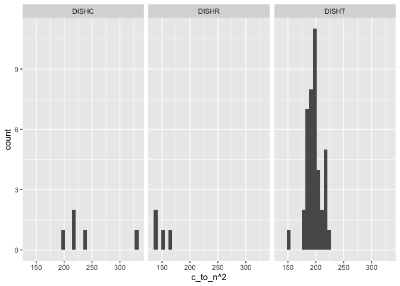

General Soil Properties
================
Emily Lacroix
Last update: 7/1/2022

-   [Setup](#setup)
    -   [Load libraries](#load-libraries)
    -   [Files](#files)
    -   [Constants](#constants)
    -   [Useful Functions](#useful-functions)
-   [Texture](#texture)
    -   [Import and wrangle data](#import-and-wrangle-data)
    -   [Calculate texture](#calculate-texture)
        -   [Write function to calculate texture from hydrometer
            readings](#write-function-to-calculate-texture-from-hydrometer-readings)
        -   [Calculate texture for each
            sample](#calculate-texture-for-each-sample)
        -   [Summarize texture data](#summarize-texture-data)
        -   [Test for differences amongst
            sites](#test-for-differences-amongst-sites)
-   [Aggregate Size](#aggregate-size)
    -   [Calculate log average aggregate size
        D](#calculate-log-average-aggregate-size-d)
    -   [Import data and calculate geometric mean diameter and
        meanweight
        diameter](#import-data-and-calculate-geometric-mean-diameter-and-meanweight-diameter)
    -   [Summarise aggregate size by
        site](#summarise-aggregate-size-by-site)
    -   [Statistics - MWD & GMD](#statistics---mwd--gmd)
        -   [MWD - ANOVA](#mwd---anova)
        -   [GMD - Wilcoxon rank sum](#gmd---wilcoxon-rank-sum)
-   [Total Carbon and Nitrogen](#total-carbon-and-nitrogen)
    -   [Import and summarise data](#import-and-summarise-data)
    -   [Statistics - total C](#statistics---total-c)
        -   [Check for normality](#check-for-normality)
        -   [Check for equal variances](#check-for-equal-variances)
        -   [ANOVA](#anova)
    -   [Statistics - C/N](#statistics---cn)
        -   [Check normality](#check-normality)
        -   [Check for equal variances](#check-for-equal-variances-1)
        -   [Wilcoxon rank sum](#wilcoxon-rank-sum)

# Setup

## Load libraries

    library(multcompView)
    library(car)
    library(tidyverse)
    library(readxl)

    options(dplyr.summarise.inform = FALSE)

## Files

    data_file <- "StanfordDish_AllData.xlsx"

## Constants

For texture analysis, all solutions were at 23 degrees C.

    concentration_hmp_g_mL <- 0.005
    viscosity_hmp_g_cm_s <- 0.9533 #value from table in Gee and Bauder 1986
    density_water_g_cm3 <- 1.0035 #specific to temperature 
    particle_density_g_cm3 <- 2.65
    g_cm_s2 <- 980.665
    hmp_density <- density_water_g_cm3 * (1 + (0.63 * concentration_hmp_g_mL))
    beta_calc <- 30 * viscosity_hmp_g_cm_s / (g_cm_s2 * (particle_density_g_cm3 - hmp_density))

## Useful Functions

    tri.to.squ<-function(x)
    {
      rn <- row.names(x)
      cn <- colnames(x)
      an <- unique(c(cn,rn))
      myval <- x[!is.na(x)]
      mymat <- 
        matrix(1, nrow = length(an), ncol = length(an), dimnames = list(an,an))
      for(ext in 1:length(cn))
      {
        for(int in 1:length(rn))
        {
          if(is.na(x[row.names(x) == rn[int], colnames(x) == cn[ext]])) next
          mymat[row.names(mymat) == rn[int], colnames(mymat) == cn[ext]] <- 
            x[row.names(x) == rn[int], colnames(x) == cn[ext]]
          mymat[row.names(mymat) == cn[ext], colnames(mymat) == rn[int]] <- 
            x[row.names(x) == rn[int], colnames(x) == cn[ext]]
        }
      }
      return(mymat)
    }

# Texture

This code calculates texture based on hydrometer readings.

## Import and wrangle data

    data <- 
      data_file %>% 
      read_xlsx(sheet = "Texture") %>% 
      mutate(
        p = 100* (hydrometer_reading_g_L - blank) / mass_g,
        h_prime = -0.164 * hydrometer_reading_g_L + 16.3,
        theta = 1000 * (beta_calc * h_prime)^0.5,
        x_um = theta * (time_min)^-0.5,
        ln_x = log(x_um) #log is the natural logarithm in R
      ) %>% 
      pivot_wider(
        id_cols = 
          c("site", "experiment", "core_num", "blank", "temperature_c", "mass_g"),
        names_from = time_min,
        values_from = c(p, h_prime, theta, x_um, ln_x)
      ) 

## Calculate texture

### Write function to calculate texture from hydrometer readings

    calculate_texture <-
      function(p_90, p_1440, ln_x_90, ln_x_1440, p_half, p_1, ln_x_half, ln_x_1){
        m_clay <- (p_90 - p_1440) / (ln_x_90 - ln_x_1440)
        p_2um <- m_clay*log(2) + p_1440
        
        m_sand <- (p_half - p_1) / (ln_x_half - ln_x_1)
        p_50um <- m_sand*log(50) + p_1440
        
        sand <- 100 - p_50um
        silt <- p_50um - p_2um
        clay <- p_2um
        
        print(paste(sand, silt, clay))
      }

### Calculate texture for each sample

    texture <- 
      data %>% 
      mutate(
        sand_silt_clay = 
          calculate_texture(
            p_90 = p_90, 
            p_1440 = p_1440, 
            ln_x_90 = ln_x_90, 
            ln_x_1440 = ln_x_1440, 
            p_half = p_0.5, 
            p_1 = p_1,
            ln_x_half = ln_x_0.5,
            ln_x_1 = ln_x_1
          )
      ) %>% 
      separate(sand_silt_clay, sep = " ", into = c("sand", "silt", "clay")) %>% 
      mutate(across(c(sand, silt, clay), as.numeric)) %>% 
      select(site, experiment, core_num, sand, silt, clay)

    ## [1] "37.6658101707024 41.0627632332954 21.2714265960022"
    ## [2] "28.8430105450218 39.8561419212061 31.3008475337722"
    ## [3] "46.1986758377631 25.0011060081928 28.8002181540441"
    ## [4] "43.8894652690132 39.1708390634719 16.9396956675149"
    ## [5] "46.4410937612074 39.7621597599921 13.7967464788006"
    ## [6] "28.8306677234205 54.8720409109024 16.297291365677" 
    ## [7] "54.0467734853181 40.9333361065826 5.01989040809932"
    ## [8] "52.7967734853181 40.9332258023854 6.27000071229652"
    ## [9] "51.5536313635488 41.5601097366285 6.88625889982279"

### Summarize texture data

    texture %>% 
      group_by(site) %>% 
      summarise(
        across(c(sand, silt, clay), list(mean = mean, se = ~sd(.)/sqrt(n()))),
        clay_normality_p = shapiro.test(clay)$p.value,
        silt_normality_p = shapiro.test(silt)$p.value,
        sand_normality_p = shapiro.test(sand)$p.value
      )

    ## # A tibble: 3 × 10
    ##   site  sand_mean sand_se silt_mean silt_se clay_mean clay_se clay_normality_p
    ##   <chr>     <dbl>   <dbl>     <dbl>   <dbl>     <dbl>   <dbl>            <dbl>
    ## 1 DISHC      37.6   5.01       35.3   5.16      27.1    3.01             0.462
    ## 2 DISHR      52.8   0.720      41.1   0.209      6.06   0.549            0.630
    ## 3 DISHT      39.7   5.49       44.6   5.14      15.7    0.959            0.372
    ## # … with 2 more variables: silt_normality_p <dbl>, sand_normality_p <dbl>

DISHC texture = clay loam DISHR texture = sandy loam DISHT texture =
loam

### Test for differences amongst sites

Sand and clay are normally distributed. Silt is not.

    leveneTest(clay ~ site, data = texture)

    ## Warning in leveneTest.default(y = y, group = group, ...): group coerced to
    ## factor.

    ## Levene's Test for Homogeneity of Variance (center = median)
    ##       Df F value Pr(>F)
    ## group  2  1.1491  0.378
    ##        6

    leveneTest(sand ~ site, data = texture)

    ## Warning in leveneTest.default(y = y, group = group, ...): group coerced to
    ## factor.

    ## Levene's Test for Homogeneity of Variance (center = median)
    ##       Df F value Pr(>F)
    ## group  2   0.827 0.4817
    ##        6

    leveneTest(silt ~ site, data = texture)

    ## Warning in leveneTest.default(y = y, group = group, ...): group coerced to
    ## factor.

    ## Levene's Test for Homogeneity of Variance (center = median)
    ##       Df F value Pr(>F)
    ## group  2  0.5486 0.6042
    ##        6

AOV for clay and sand

    sand_aov <- aov(sand ~ site, data = texture)
    summary(sand_aov)

    ##             Df Sum Sq Mean Sq F value Pr(>F)  
    ## site         2  407.6  203.81   3.652 0.0917 .
    ## Residuals    6  334.9   55.81                 
    ## ---
    ## Signif. codes:  0 '***' 0.001 '**' 0.01 '*' 0.05 '.' 0.1 ' ' 1

    clay_aov <- aov(clay ~ site, data = texture)
    summary(clay_aov)

    ##             Df Sum Sq Mean Sq F value  Pr(>F)    
    ## site         2  667.3   333.6   32.38 0.00061 ***
    ## Residuals    6   61.8    10.3                    
    ## ---
    ## Signif. codes:  0 '***' 0.001 '**' 0.01 '*' 0.05 '.' 0.1 ' ' 1

    TukeyHSD(clay_aov)

    ##   Tukey multiple comparisons of means
    ##     95% family-wise confidence level
    ## 
    ## Fit: aov(formula = clay ~ site, data = texture)
    ## 
    ## $site
    ##                   diff        lwr        upr     p adj
    ## DISHR-DISHC -21.065447 -29.107704 -13.023191 0.0004861
    ## DISHT-DISHC -11.446253 -19.488509  -3.403997 0.0112251
    ## DISHT-DISHR   9.619194   1.576938  17.661451 0.0243507

Pairwise Wilcoxon for silt

    silt_wilcox <- 
      pairwise.wilcox.test(
      x = texture$silt,
      g = texture$site,
      p.adjust.method = "BH",
      paired = FALSE
    )

    silt_wilcox

    ## 
    ##  Pairwise comparisons using Wilcoxon rank sum exact test 
    ## 
    ## data:  texture$silt and texture$site 
    ## 
    ##       DISHC DISHR
    ## DISHR 1     -    
    ## DISHT 1     1    
    ## 
    ## P value adjustment method: BH

    silt_matrix_site <- tri.to.squ(silt_wilcox$p.value)
    silt_letters_site <- multcompLetters(silt_matrix_site, compare ="<=", threshold = 0.05, Letters = letters)

    silt_letters_site

    ## $Letters
    ## DISHC DISHR DISHT 
    ##   "a"   "a"   "a" 
    ## 
    ## $LetterMatrix
    ##          a
    ## DISHC TRUE
    ## DISHR TRUE
    ## DISHT TRUE

# Aggregate Size

## Calculate log average aggregate size D

    max_size <- 50
    sieve1 <- 27
    sieve2 <- 19
    sieve3 <- 9.4
    sieve4 <- 6.7
    sieve5 <- 4.7
    sieve6 <- 2
    pan <- 0

    log_sizes <-
      tibble(
        name = 
          c(
            "size1",
            "size2", 
            "size3", 
            "size4", 
            "size5",
            "size6",
            "size7"
          ), 
        log_size = 
          c(
            log(mean(c(max_size, sieve1))),
            log(mean(c(sieve1, sieve2))),
            log(mean(c(sieve2, sieve3))),
            log(mean(c(sieve3, sieve4))),
            log(mean(c(sieve4, sieve5))),
            log(mean(c(sieve5, sieve6))),
            log(mean(c(sieve6, pan)))
            ),
        avg_size = 
          c(
            mean(c(max_size, sieve1)),
            mean(c(sieve1, sieve2)),
            mean(c(sieve2, sieve3)),
            mean(c(sieve3, sieve4)),
            mean(c(sieve4, sieve5)),
            mean(c(sieve5, sieve6)),
            mean(c(sieve6, pan))
            )
      )

    sieve_key <- 
      c(
        `27mm` = "size1", 
        `19mm` = "size2", 
        `9.4mm` = "size3", 
        `6.7mm` = "size4", 
        `4.7mm` = "size5",
        `2mm` = "size6",
        `less_2_mm` = "size7"
      )

    log_sizes

    ## # A tibble: 7 × 3
    ##   name  log_size avg_size
    ##   <chr>    <dbl>    <dbl>
    ## 1 size1     3.65    38.5 
    ## 2 size2     3.14    23   
    ## 3 size3     2.65    14.2 
    ## 4 size4     2.09     8.05
    ## 5 size5     1.74     5.7 
    ## 6 size6     1.21     3.35
    ## 7 size7     0        1

## Import data and calculate geometric mean diameter and meanweight diameter

    aggregate <-
      data_file %>% 
      read_xlsx(sheet = "AggregateSize") %>% 
      pivot_longer(cols = ends_with("mm"), names_to = "size", values_to = "mass_g") %>% 
      mutate(across(size, ~recode(., !!!sieve_key))) %>% 
      left_join(log_sizes, by = c("size" = "name")) %>% 
      mutate(
        wi_logx = mass_g * log_size,
        wi_x = (mass_g / total_mass_g) * avg_size
      ) %>% 
      group_by(sample, rep) %>% 
      summarise(
        sum_wi_logx = sum(wi_logx),
        sum_wi = sum(mass_g),
        mwd = sum(wi_x)
      ) %>% 
      mutate(
        gmd = exp(sum_wi_logx / sum_wi)
      )

    aggregate

    ## # A tibble: 9 × 6
    ## # Groups:   sample [3]
    ##   sample   rep sum_wi_logx sum_wi   mwd   gmd
    ##   <chr>  <dbl>       <dbl>  <dbl> <dbl> <dbl>
    ## 1 DISHC      1        754.    396  9.84  6.72
    ## 2 DISHC      2        860.    369 16.9  10.3 
    ## 3 DISHC      3        659.    282 14.2  10.3 
    ## 4 DISHR      1        240.    344  5.70  2.01
    ## 5 DISHR      2        191.    363  2.98  1.69
    ## 6 DISHR      3        261.    324  5.05  2.24
    ## 7 DISHT      1        514.    262 12.7   7.11
    ## 8 DISHT      2        573.    317 10.7   6.09
    ## 9 DISHT      3        503.    315  9.00  4.94

## Summarise aggregate size by site

    aggregate %>% 
      group_by(sample) %>% 
      summarise(
        mean_mwd = mean(mwd),
        se_mwd = sd(mwd) / sqrt(n()),
        mean_gmd = mean(gmd),
        se_gmd = sd(gmd) / sqrt(n()),
        normality_p_mwd = shapiro.test(mwd)$p.value,
        normality_p_gmd = shapiro.test(gmd)$p.value
      )

    ## # A tibble: 3 × 7
    ##   sample mean_mwd se_mwd mean_gmd se_gmd normality_p_mwd normality_p_gmd
    ##   <chr>     <dbl>  <dbl>    <dbl>  <dbl>           <dbl>           <dbl>
    ## 1 DISHC     13.7   2.05      9.11  1.20            0.720          0.0296
    ## 2 DISHR      4.57  0.820     1.98  0.157           0.438          0.825 
    ## 3 DISHT     10.8   1.05      6.05  0.628           0.922          0.939

## Statistics - MWD & GMD

### MWD - ANOVA

    leveneTest(mwd ~ sample, data = aggregate)

    ## Warning in leveneTest.default(y = y, group = group, ...): group coerced to
    ## factor.

    ## Levene's Test for Homogeneity of Variance (center = median)
    ##       Df F value Pr(>F)
    ## group  2  0.7137 0.5271
    ##        6

    aov_mwd <- aov(mwd ~ sample, data = aggregate)
    summary(aov_mwd)

    ##             Df Sum Sq Mean Sq F value Pr(>F)  
    ## sample       2 129.16   64.58   10.81 0.0102 *
    ## Residuals    6  35.84    5.97                 
    ## ---
    ## Signif. codes:  0 '***' 0.001 '**' 0.01 '*' 0.05 '.' 0.1 ' ' 1

    TukeyHSD(aov_mwd)

    ##   Tukey multiple comparisons of means
    ##     95% family-wise confidence level
    ## 
    ## Fit: aov(formula = mwd ~ sample, data = aggregate)
    ## 
    ## $sample
    ##                  diff          lwr       upr     p adj
    ## DISHR-DISHC -9.076363 -15.19938556 -2.953340 0.0092769
    ## DISHT-DISHC -2.866716  -8.98973877  3.256307 0.3824244
    ## DISHT-DISHR  6.209647   0.08662414 12.332669 0.0474027

### GMD - Wilcoxon rank sum

    gmd_wilcox <- 
      pairwise.wilcox.test(
      x = aggregate$gmd,
      g = aggregate$sample,
      p.adjust.method = "BH",
      paired = FALSE
    )

    gmd_wilcox

    ## 
    ##  Pairwise comparisons using Wilcoxon rank sum exact test 
    ## 
    ## data:  aggregate$gmd and aggregate$sample 
    ## 
    ##       DISHC DISHR
    ## DISHR 0.15  -    
    ## DISHT 0.20  0.15 
    ## 
    ## P value adjustment method: BH

    gmd_matrix_site <- tri.to.squ(gmd_wilcox$p.value)
    gmd_letters_site <- multcompLetters(gmd_matrix_site, compare ="<=", threshold = 0.05, Letters = letters)

    gmd_letters_site

    ## $Letters
    ## DISHC DISHR DISHT 
    ##   "a"   "a"   "a" 
    ## 
    ## $LetterMatrix
    ##          a
    ## DISHC TRUE
    ## DISHR TRUE
    ## DISHT TRUE

# Total Carbon and Nitrogen

## Import and summarise data

    carbon_nitrogen <- 
      data_file %>% 
      read_xlsx(sheet = "TotalCarbon") %>% 
      group_by(site) %>% 
      mutate(
        n = n()
      ) %>% 
      group_by(site, n) %>% 
      summarise(across(c(perc_c, perc_n), list(mean = mean, sd = sd))) %>% 
      mutate(
        se_perc_c = perc_c_sd / sqrt(n),
        se_perc_n = perc_n_sd / sqrt(n),
      ) %>% 
      select(site, perc_c_mean, se_perc_c, perc_n_mean, se_perc_n)

    carbon_nitrogen %>% knitr::kable()

| site  | perc\_c\_mean | se\_perc\_c | perc\_n\_mean | se\_perc\_n |
|:------|--------------:|------------:|--------------:|------------:|
| DISHC |      1.788752 |   0.1385081 |     0.1158103 |   0.0071870 |
| DISHR |      1.069381 |   0.0732260 |     0.0880442 |   0.0072843 |
| DISHT |      1.261754 |   0.0412646 |     0.0901348 |   0.0029735 |

## Statistics - total C

### Check for normality

    data_file %>% 
      read_xlsx(sheet = "TotalCarbon") %>% 
      group_by(site) %>% 
      summarise(
        p_normality = shapiro.test(perc_c)$p.value
      )

    ## # A tibble: 3 × 2
    ##   site  p_normality
    ##   <chr>       <dbl>
    ## 1 DISHC       0.695
    ## 2 DISHR       0.969
    ## 3 DISHT       0.293

Percent C is normally distributed

### Check for equal variances

    leveneTest(
      perc_c ~ site, 
      data = data_file %>% 
        read_xlsx(sheet = "TotalCarbon")
    )

    ## Warning in leveneTest.default(y = y, group = group, ...): group coerced to
    ## factor.

    ## Levene's Test for Homogeneity of Variance (center = median)
    ##       Df F value Pr(>F)
    ## group  2  1.0026 0.3746
    ##       47

Variances are equal.

### ANOVA

    perc_c_aov <- 
      aov(
      perc_c ~ site, 
      data = data_file %>% 
        read_xlsx(sheet = "TotalCarbon")
    )

    summary(perc_c_aov)

    ##             Df Sum Sq Mean Sq F value   Pr(>F)    
    ## site         2  1.467  0.7335   10.64 0.000154 ***
    ## Residuals   47  3.241  0.0689                     
    ## ---
    ## Signif. codes:  0 '***' 0.001 '**' 0.01 '*' 0.05 '.' 0.1 ' ' 1

Significant differences. Do TukeyHSD as post-hoc test.

    TukeyHSD(perc_c_aov)

    ##   Tukey multiple comparisons of means
    ##     95% family-wise confidence level
    ## 
    ## Fit: aov(formula = perc_c ~ site, data = data_file %>% read_xlsx(sheet = "TotalCarbon"))
    ## 
    ## $site
    ##                   diff        lwr        upr     p adj
    ## DISHR-DISHC -0.7193712 -1.1456618 -0.2930806 0.0004937
    ## DISHT-DISHC -0.5269974 -0.8280216 -0.2259731 0.0003042
    ## DISHT-DISHR  0.1923738 -0.1405032  0.5252508 0.3498271

## Statistics - C/N

    c_to_n <- 
      data_file %>% 
      read_xlsx(sheet = "TotalCarbon") %>% 
      mutate(c_to_n = perc_c / perc_n)

### Check normality

    c_to_n %>% 
      group_by(site) %>% 
      summarise(
        avg_c_to_n = mean(c_to_n, na.rm = TRUE),
        se_c_to_n = sd(c_to_n) / sqrt(n()),
        p_normality = shapiro.test(c_to_n)$p.value,
        p_normality2 = shapiro.test(c_to_n^2)$p.value,
      )

    ## # A tibble: 3 × 5
    ##   site  avg_c_to_n se_c_to_n p_normality p_normality2
    ##   <chr>      <dbl>     <dbl>       <dbl>        <dbl>
    ## 1 DISHC       15.4    0.733       0.127        0.0839
    ## 2 DISHR       12.2    0.206       0.312        0.304 
    ## 3 DISHT       14.0    0.0757      0.0475       0.0922

    c_to_n %>% 
      ggplot(aes(x = c_to_n^2)) + 
      geom_histogram() + 
      facet_grid(cols = vars(site))

    ## `stat_bin()` using `bins = 30`. Pick better value with `binwidth`.

<!-- -->

Will try a squared transformation

### Check for equal variances

    leveneTest(c_to_n^2 ~ site, data = c_to_n)

    ## Warning in leveneTest.default(y = y, group = group, ...): group coerced to
    ## factor.

    ## Levene's Test for Homogeneity of Variance (center = median)
    ##       Df F value  Pr(>F)  
    ## group  2  4.1455 0.02198 *
    ##       47                  
    ## ---
    ## Signif. codes:  0 '***' 0.001 '**' 0.01 '*' 0.05 '.' 0.1 ' ' 1

With a transformation, the C to N ratio can be normally distributed but
no equal variances. Will need to use pairwise Wilcoxon rank sum

### Wilcoxon rank sum

    c_to_n_wilcox <- 
      pairwise.wilcox.test(
      x = c_to_n$c_to_n,
      g = c_to_n$site,
      p.adjust.method = "BH",
      paired = FALSE
    )

    c_to_n_wilcox

    ## 
    ##  Pairwise comparisons using Wilcoxon rank sum exact test 
    ## 
    ## data:  c_to_n$c_to_n and c_to_n$site 
    ## 
    ##       DISHC  DISHR  
    ## DISHR 0.0159 -      
    ## DISHT 0.0066 8.1e-05
    ## 
    ## P value adjustment method: BH

    c_to_n_matrix_site <- tri.to.squ(c_to_n_wilcox$p.value)
    c_to_n_letters_site <- multcompLetters(c_to_n_matrix_site, compare ="<=", threshold = 0.05, Letters = letters)

    c_to_n_letters_site

    ## DISHC DISHR DISHT 
    ##   "a"   "b"   "c"
