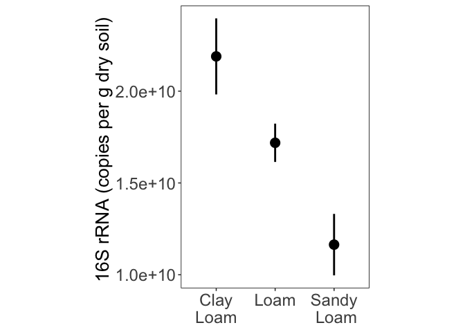
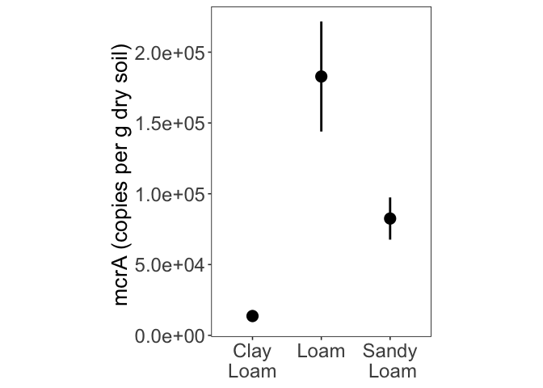
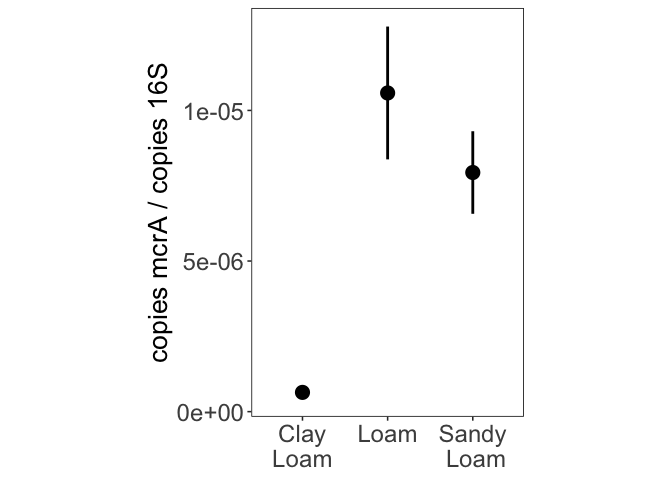

ddPCR
================
Emily Lacroix
Last update: 1/14/2022

-   [Set-up](#set-up)
    -   [Libraries](#libraries)
    -   [Files](#files)
    -   [Labels](#labels)
    -   [Figure theme](#figure-theme)
    -   [Load data](#load-data)
-   [16S - absolute abundance](#16s---absolute-abundance)
    -   [Figure S7](#figure-s7)
-   [mcrA - absolute abundance](#mcra---absolute-abundance)
    -   [Figure S8](#figure-s8)
    -   [Statistics](#statistics)
        -   [Check normality of log transformed copies per g
            mcrA](#check-normality-of-log-transformed-copies-per-g-mcra)
        -   [Check for equal variances of log transformed copies per g
            mcrA](#check-for-equal-variances-of-log-transformed-copies-per-g-mcra)
        -   [ANOVA of log transformed copies per g
            mcrA](#anova-of-log-transformed-copies-per-g-mcra)
-   [Normalized mcrA](#normalized-mcra)
    -   [Figure 5](#figure-5)
    -   [Statistics](#statistics-1)
        -   [Check normality](#check-normality)
        -   [Check for equal variances](#check-for-equal-variances)
        -   [ANOVA](#anova)

# Set-up

## Libraries

    library(readxl)
    library(MASS)
    library(car)
    library(scales)
    library(tidyverse)
    library(conflicted)

    conflicted::conflict_prefer("select", "dplyr")
    conflicted::conflict_prefer("filter", "dplyr")

## Files

    data_file <- "StanfordDish_AllData.xlsx"

## Labels

    site_labels <- c(
      "DISHC" = "Clay\nLoam",
      "DISHT" = "Loam",
      "DISHR" = "Sandy\n Loam"
    )

## Figure theme

    my_theme <- function(base_size = 12, base_family = ""){ ## Control base font face and size. use `rel()` for relative font size.
      theme_bw(base_size = base_size, base_family = base_family) %+replace%
        theme(
          panel.border = element_rect(colour = "black", fill = "transparent"),
          panel.background  = element_blank(),
          panel.grid = element_blank(),
          strip.background = element_blank(),
          legend.position="top",
          legend.title = element_blank(),
          strip.text = element_text(size = 13)
        )
    }

## Load data

    ddpcr <- 
      read_xlsx(data_file, sheet = "ddPCR") %>% 
      mutate(
        across(
          site, 
          ~factor(., levels = c("DISHC", "DISHT", "DISHR"), labels = site_labels)
        )
      )

# 16S - absolute abundance

## Figure S7

    ddpcr %>% 
      group_by(site) %>% 
      summarise(
        mean_16s = mean(copies_per_g_16s),
        se_16s = sd(copies_per_g_16s) / sqrt(n())
      ) %>% 
      ggplot(aes(x = site, y = mean_16s)) + 
      geom_pointrange(
        aes(ymin = mean_16s - se_16s, ymax = mean_16s + se_16s),
        fatten = 4,
        size = 1
      ) +
      my_theme() + 
      theme(
        axis.text = element_text(size = 18),
        axis.title = element_text(size = 20),
        aspect.ratio = 1.5
      ) +
      labs(
        y = "16S rRNA (copies per g dry soil) ",
        x = NULL
      )

<!-- -->

# mcrA - absolute abundance

## Figure S8

    ddpcr %>% 
      group_by(site) %>% 
      summarise(
        mean_mcrA = mean(copies_per_g_mcra, na.rm = TRUE),
        se_mcrA = sd(copies_per_g_mcra, na.rm = TRUE) / sqrt(n())
      ) %>% 
      ggplot(aes(x = site, y = mean_mcrA)) + 
      geom_pointrange(
        aes(ymin = mean_mcrA - se_mcrA, ymax = mean_mcrA + se_mcrA),
        fatten = 4,
        size = 1
      ) +
      scale_y_continuous(labels = scientific) +
      my_theme() + 
      theme(
        axis.text = element_text(size = 18),
        axis.title = element_text(size = 20),
        aspect.ratio = 1.5
      ) +
      labs(
        y = "mcrA (copies per g dry soil) ",
        x = NULL
      )

<!-- -->

## Statistics

Non-transformed mcrA copies per g are normally distributed with very
unequal variances.

### Check normality of log transformed copies per g mcrA

    ddpcr %>% 
      mutate(log_copies = log(copies_per_g_mcra + 5656)) %>% #adding half the lowest non-zero value
      group_by(site) %>% 
      summarize(p_normality = shapiro.test(log_copies)$p.value) 

    ## # A tibble: 3 × 2
    ##   site           p_normality
    ##   <fct>                <dbl>
    ## 1 "Clay\nLoam"        0.0700
    ## 2 "Loam"              0.814 
    ## 3 "Sandy\n Loam"      0.335

### Check for equal variances of log transformed copies per g mcrA

    leveneTest(
      log_copies ~ site, 
      data = 
        ddpcr %>% mutate(log_copies = log(copies_per_g_mcra + 5656))
    )

    ## Levene's Test for Homogeneity of Variance (center = median)
    ##       Df F value Pr(>F)
    ## group  2  0.5265 0.5995
    ##       18

Log transformed variances ARE equal.

### ANOVA of log transformed copies per g mcrA

    aov_conc_site_manual <- 
      aov(
      log_copies ~ site, 
        ddpcr %>% mutate(log_copies = log(copies_per_g_mcra + 5656))
    )

    aov_conc_site_manual %>% summary()

    ##             Df Sum Sq Mean Sq F value   Pr(>F)    
    ## site         2 20.356  10.178   31.06 1.46e-06 ***
    ## Residuals   18  5.898   0.328                     
    ## ---
    ## Signif. codes:  0 '***' 0.001 '**' 0.01 '*' 0.05 '.' 0.1 ' ' 1

    TukeyHSD(aov_conc_site_manual) 

    ##   Tukey multiple comparisons of means
    ##     95% family-wise confidence level
    ## 
    ## Fit: aov(formula = log_copies ~ site, data = ddpcr %>% mutate(log_copies = log(copies_per_g_mcra + 5656)))
    ## 
    ## $site
    ##                               diff        lwr        upr     p adj
    ## Loam-Clay\nLoam          2.3509918  1.5700806 3.13190297 0.0000013
    ## Sandy\n Loam-Clay\nLoam  1.6408613  0.8599501 2.42177248 0.0001207
    ## Sandy\n Loam-Loam       -0.7101305 -1.4910417 0.07078067 0.0783673

There are significant differences between: 1) Loam & Clayey Loam 2)
Sandy Loam & Clayey Loam

# Normalized mcrA

## Figure 5

    ddpcr %>% 
      group_by(site) %>% 
      summarize(
        mean_prop_mcra = mean(proportion_mcra),
        se_prop_mcra = sd(proportion_mcra) / sqrt(n())
      ) %>% 
      ggplot(aes(x = site, y = mean_prop_mcra)) + 
      geom_pointrange(
        aes(
          ymin = mean_prop_mcra - se_prop_mcra, 
          ymax = mean_prop_mcra + se_prop_mcra
        ),
        fatten = 4,
        size = 1
      ) + 
      my_theme() + 
      theme(
        axis.text = element_text(size = 18),
        axis.title = element_text(size = 20),
        aspect.ratio = 1.5
      ) +
      labs(
        y = "copies mcrA / copies 16S",
        x = NULL
      )

<!-- -->

## Statistics

### Check normality

    ddpcr %>%   
      group_by(site) %>% 
      summarize(p_normality = shapiro.test(proportion_mcra)$p.value)

    ## # A tibble: 3 × 2
    ##   site           p_normality
    ##   <fct>                <dbl>
    ## 1 "Clay\nLoam"        0.452 
    ## 2 "Loam"              0.114 
    ## 3 "Sandy\n Loam"      0.0785

### Check for equal variances

    leveneTest(
      proportion_mcra ~ site, 
      data = ddpcr
    )

    ## Levene's Test for Homogeneity of Variance (center = median)
    ##       Df F value Pr(>F)
    ## group  2    1.83  0.189
    ##       18

Proportion mcrA is normally distributed with equal variances.

### ANOVA

    aov_prop_mcra <- 
      aov(
      proportion_mcra ~ site, 
      data = ddpcr
    )

    aov_prop_mcra %>% summary()

    ##             Df    Sum Sq   Mean Sq F value   Pr(>F)    
    ## site         2 3.712e-10 1.856e-10   11.74 0.000546 ***
    ## Residuals   18 2.846e-10 1.581e-11                     
    ## ---
    ## Signif. codes:  0 '***' 0.001 '**' 0.01 '*' 0.05 '.' 0.1 ' ' 1

    TukeyHSD(aov_prop_mcra) 

    ##   Tukey multiple comparisons of means
    ##     95% family-wise confidence level
    ## 
    ## Fit: aov(formula = proportion_mcra ~ site, data = ddpcr)
    ## 
    ## $site
    ##                                  diff           lwr          upr     p adj
    ## Loam-Clay\nLoam          9.940477e-06  4.516121e-06 1.536483e-05 0.0005246
    ## Sandy\n Loam-Clay\nLoam  7.299456e-06  1.875099e-06 1.272381e-05 0.0079110
    ## Sandy\n Loam-Loam       -2.641021e-06 -8.065378e-06 2.783336e-06 0.4444694

Like the absolute abundance mcrA data, there is a significant difference
between: 1) Loam & Clayey Loam 2) Sandy Loam & Clayey Loam
